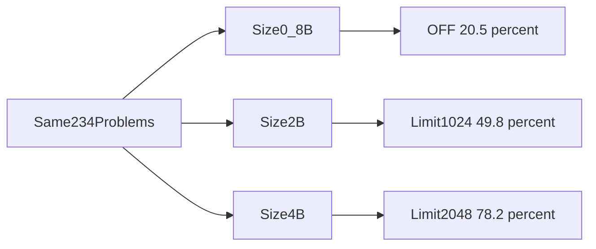

# The results

The free thinking limit was the most accurate way on the 2B model.
Training did not make thinking shorter.
The same pattern holds on 0.8B and 4B: a free way wins, and the best free way grows with size.

## Everyday example

You time six routes to school.
One route is "don't plan, just walk".
One route is "plan, but stop the plan after one page".
The short plan wins.
The fancy study notes do not beat it.

## Where we are

```text
PROBLEM ✅ → GAP ✅ → QUESTION ✅ → HYPOTHESIS ✅ → EXPERIMENT ✅ → DATA ✅ → RESULTS ← here
```

Numbers below are copied from [../results/full-results/FULL-RESULTS.md](../results/full-results/FULL-RESULTS.md)
and [../results/SIZE-COMPARISON.md](../results/SIZE-COMPARISON.md).

## Main 2B scores

234 problems, 2 tries, 468 answers per way.


| Way | Passed | Accuracy | Versus normal thinking |
|---|---|---|---|
| Thinking ON | 197 / 468 | **42.1%** | — |
| Thinking OFF | 191 / 468 | **40.8%** | −1.3 points [−6.6, +4.3] |
| Think briefly | 31 / 468 | **6.6%** | −35.5 points [−41.2, −29.3] |
| Limit 1,024 | 233 / 468 | **49.8%** | **+7.7 points [+4.3, +11.3]** |
| LoRA-1 | 213 / 468 | **45.5%** | +3.4 points [−0.4, +7.7] |
| LoRA-2 (main) | 211 / 468 | **45.1%** | +3.0 points [−1.1, +7.3] |

Only the limit's gain over normal thinking is proven.
Its error bar is fully above zero.
LoRA-2's +3.0 point gain includes zero, so we cannot prove it.


## By problem group (2B)

| Way | HumanEval+ (164) | LiveCodeBench easy (31) | LiveCodeBench medium (39) |
|---|---|---|---|
| Thinking ON | 55.2% | 24.2% | 1.3% |
| Thinking OFF | 47.3% | 46.8% | **9.0%** |
| Think briefly | 3.7% | 30.6% | 0.0% |
| Limit 1,024 | **60.4%** | **56.5%** | 0.0% |
| LoRA-1 | 56.4% | 41.9% | 2.6% |
| LoRA-2 | 56.4% | 38.7% | 2.6% |

On easy functions, thinking helps: turning it off costs **7.9 points** [−14.6, −1.2].
On easy LiveCodeBench, normal thinking is weak, and the limit gains **+32.3 points** [+17.7, +46.8].
On medium LiveCodeBench, almost nothing works.
Only thinking OFF solves a few (**9.0%**).

## Did training do what we asked?

| Part | Needed | Result | Verdict |
|---|---|---|---|
| H1 shorter thinking | ≤ 0.75× | **x1.00** [0.94, 1.06] | No |
| H2 accuracy held | loss ≤ 3 points | **+3.0** [−1.1, +7.3] | Yes (it did not get worse) |
| H3 beats the limit | higher than the limit | **−4.7** [−9.0, −0.2] | No. The limit is better |

The research answer on 2B is **no**.
Training was not better than the free options.

## Tokens, the real cost

| Way | All tokens (average) | Thinking versus ON |
|---|---|---|
| Thinking ON | **3,446** | — |
| Thinking OFF | **860** | no thinking notes |
| Limit 1,024 | **2,722** | x0.26 of ON's thinking |
| LoRA-1 | 3,158 | x0.87 [0.81, 0.93] |
| LoRA-2 | 3,392 | **x1.00** [0.94, 1.06] |

The limit's thinking notes are short.
After the cut, it still writes a long answer part (1,879 tokens on average).
Count **all** tokens and the saving is **21%**, not 74%.

## The 2B limit curve

Later fill-ins added two more limits on the same 234 problems.

```text
Limit 512     45.1%    (2 tries)
Limit 1,024   49.8%    (2 tries)   ← peak
Limit 2,048   46.6%    (1 try)
```

A longer cap than 1,024 did **not** help this 2B model.
Say that 46.6% is **one try**.
The other two cells are two tries.

## Three sizes



| Way | 0.8B (1 try) | 2B | 4B (2 tries) |
|---|---|---|---|
| Thinking OFF | **20.5%** | 40.8% | 69.7% |
| Thinking ON | 7.3% | 42.1% | 64.3% |
| Limit 512 | 17.5% | 45.1% | 75.4% |
| Limit 1,024 | 13.2% | **49.8%** | 76.5% |
| Limit 2,048 | — | 46.6% (1 try) | **78.2%** |
| Limit 4,096 | — | — | 76.7% |
| LoRA-1 | 17.9% | 45.5% | 69.9% |

| Size | Best free way | Beats LoRA-1? |
|---|---|---|
| 0.8B | OFF at 20.5% | Yes (17.9%) |
| 2B | Limit 1,024 at 49.8% | Yes (45.5%) |
| 4B | Limit 2,048 at 78.2% | Yes (69.9%) |

Normal thinking hits the wall less often as the model grows: **78%** cut off on 0.8B, about **41%** on 2B, **28%** on 4B.
Bigger is more accurate on every way.
The free winner still changes with size.
LoRA-1 still loses.

## A later check: 40 newer contest problems

The first exam stays **234** problems.
The scores above do not change.

After that exam, we graded **40** more LiveCodeBench problems.
The dates run from 30 November 2024 to 4 January 2025.
17 are easy. 23 are medium.
None are in the exam. None are in training.
This list has no easy function questions.
That is why every score here is lower.

The run took **3.7 hours** on an A100, under a 4.5 hour cap.

| Way | 0.8B (1 try) | 2B | 4B (2 tries) |
|---|---|---|---|
| Thinking OFF | **5.0%** (2/40) | **12.5%** (10/80) | **46.2%** (37/80) |
| Thinking ON | 0% (0/40) | 0% (0/80) | 18.8% (15/80) |
| Limit 512 | 0% | 6.2% (5/80) | not run |
| Limit 1,024 | 0% | 8.8% (7/80) | not run |
| Limit 2,048 | — | 7.5% (3/40, 1 try) | **46.2%** (37/80) |
| Think briefly | — | 5.0% (4/80) | — |
| LoRA-1 | 0% (0/40) | not run | not run |

On these 40, a free way still wins.
Thinking OFF wins on 0.8B and on 2B.
On 4B, OFF and the 2,048 limit tie.
Thinking ON is the weak way.
It hit the token wall on **92%** of 2B answers and **81%** of 4B answers.

The 2B lead for OFF is **3 answers out of 80**.
We have not drawn error bars, so this is not a new proven winner.
It is enough to say the 1,024 limit did not win this list.

On 4B the tie splits by difficulty:

| 4B way | Easy (34 answers) | Medium (46 answers) |
|---|---|---|
| Thinking OFF | **73.5%** | 26.1% |
| Limit 2,048 | 67.6% | **30.4%** |
| Thinking ON | 41.2% | 2.2% |

2B training and 4B training did not run on these 40.
The 2B weight files were missing, so those ways were skipped.
4B stopped after thinking ON.
The next job would have broken the spare half hour.
On 0.8B, training scored **0 out of 40**. OFF still won.

These 40 stay in their own table.
The first exam was locked before anyone saw a score.
Adding them into 49.8% would hide this result, because the old 234 would still dominate the average.

The saved scores are in [../results/extra/SUMMARY.md](../results/extra/SUMMARY.md).

## The early test, for contrast

On 100 easy MBPP+ problems that look like the training data, LoRA-1 scored **65%** against **50%** and used **41% fewer tokens**.
On HumanEval+, which is a different easy-function set, that shortening almost disappeared (x0.94).
Training helped on problems like its homework.
It did not travel cleanly to the exam.
