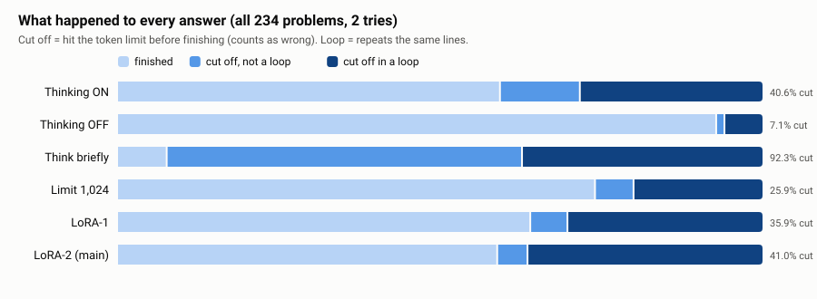
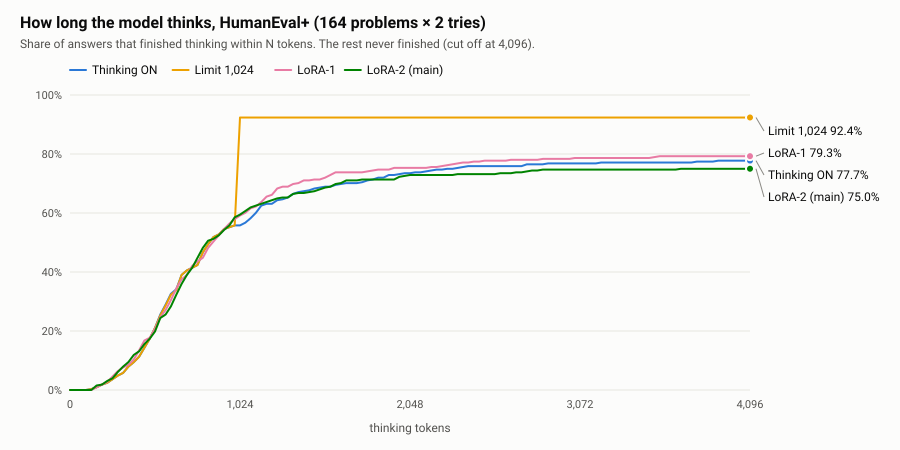

# Why the limit works, and training does not

The model was not mainly thinking too carefully.
It was getting stuck.
A limit cuts the stuck text.
Training on short finished answers never shows the model how to escape a loop.

## Everyday example

A student who knows the answer writes half a page and stops.
A student who is stuck copies the same sentence until the paper is full.
Showing them a neat short essay does not teach them to notice the copy loop.
Taking the pen away after one page does.

## The loop counts



| Way | Cut off | Of those, stuck in a loop |
|---|---|---|
| Thinking ON | 190 of 468 (**40.6%**) | **69.5%** |
| Thinking OFF | 33 of 468 (7.1%) | 81.8% |
| Think briefly | 432 of 468 (92.3%) | 40.3% |
| Limit 1,024 | 121 of 468 (25.9%) | 76.9% |
| LoRA-1 | 168 of 468 (35.9%) | 83.9% |
| LoRA-2 | 192 of 468 (41.0%) | **88.5%** |

Training did not reduce loops.
LoRA-2's unfinished answers were loops even more often than normal thinking.

A real loop, from thinking ON on HumanEval/1, cut off at 4,096 tokens.
This is the end of the saved notes.
The same sentences return again and again:

```text
The implementation requires careful tracking of parentheses groups...
By iterating through the string, I can identify balanced groups...
The implementation requires careful tracking of parentheses groups...
By iterating through the string, I can identify balanced groups...
```

## Finished answers were already short

On HumanEval+, the middle thinking length of answers that **finished** was **672** tokens for normal thinking.
The long average (1,564 thinking tokens) is pulled up by the cut-off loops.
So there was little "too long but finished" thinking for the add-on to copy.



## Why the training examples could not fix this

```text
Shortest correct answer  →  a finished, fairly short note
What the model does wrong on the test  →  a loop that never finishes
```

You cannot teach "get unstuck" with examples that never get stuck.

Two extra facts from the training funnel:

1. On older LiveCodeBench, only **1 of 160** medium tries was correct.
   The kept examples there had a middle length of **4,709** tokens.
   LoRA-2 then thought **longer** on LiveCodeBench than LoRA-1.
2. On MBPP+, the early add-on really did get shorter (x0.59) and more accurate (65% vs 50%).
   Those problems look like the homework.
   HumanEval+ is a different set of easy functions, and the shortening faded.

The add-on did learn something.
Its training loss fell from about 0.25 to about 0.16.
It learned the examples it was given.
Those examples were the wrong lesson for loops.

## Why a limit is efficient

| | Thinking notes | All tokens | Accuracy |
|---|---|---|---|
| Normal thinking | 3,262 average | 3,446 | 42.1% |
| Limit 1,024 | 843 average | 2,722 | 49.8% |
| Thinking OFF | 0 | 860 | 40.8% |

The limit spends fewer tokens **and** passes more tests on this 2B run.
That is the efficiency claim we checked.

It is not magic.
On medium LiveCodeBench the limit solved **nothing** (0 of 78 answers).
If the model has not found the idea by 1,024 tokens, cutting it does not create the idea.
On those problems, thinking OFF was the least bad free way (9.0%).

Giving normal thinking 16,384 tokens raised HumanEval+ from 53.7% to 59.1% on the cut-off retry.
The limit was still at 60.4%, and it used far less room.
More room did not rescue open thinking.

## Why "think briefly" failed

The prompt already said "answer with one Python code block only".
The extra sentence said "think briefly, then give the answer".
The model argued with the two rules and often never finished.
Only **36 of 468** brief answers finished.
This is a result for **this wording**, not for every way of asking for a short answer.

A snippet from HumanEval/0, try 1:

```text
"Answer with one Python code block only" suggests I should not include filler.
"Think briefly... then give the answer." suggests I should include the thinking.
Wait, if I output thinking text, is it "one Python code block only"?
```

## Why the best cap grows with size

A weak student (0.8B) does best when told not to plan.
Open thinking cut off **78%** of its answers, and accuracy fell to **7.3%**.
OFF won at **20.5%**.

A mid student (2B) can use about 1,024 tokens of notes.
512 helps (45.1%).
2,048 does not beat 1,024 (46.6% vs 49.8%).

A stronger student (4B) can use about 2,048 tokens.
That cap won at **78.2%**.
Open thinking still lost (64.3%) because **28%** of answers still hit the wall.

So the efficient setting is not one number for every model.
It is: **match the cap to the size, and prefer OFF when the model is tiny.**
