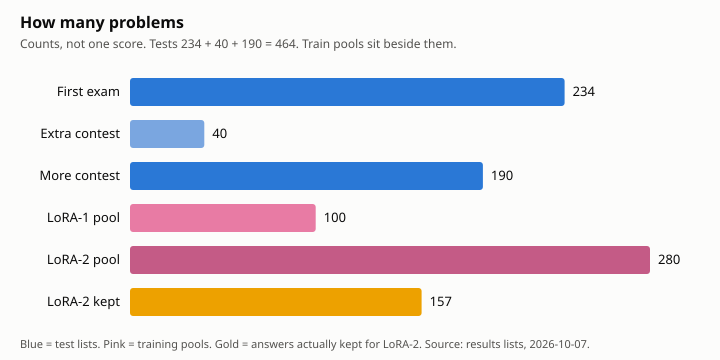
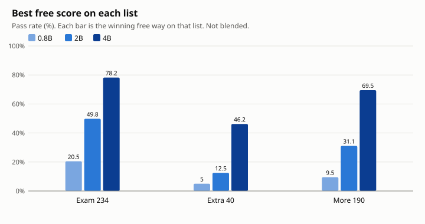
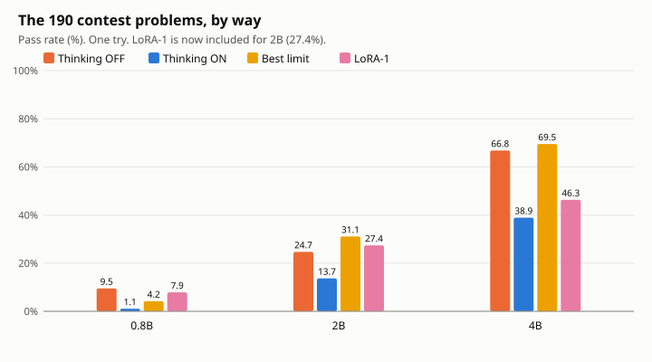
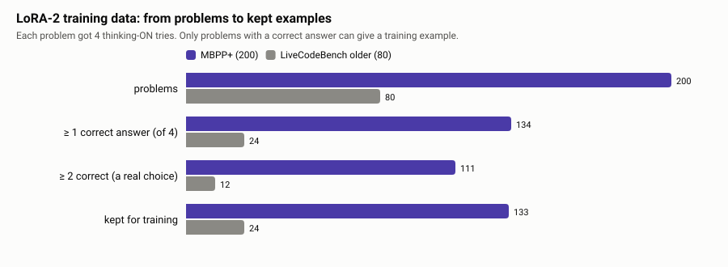
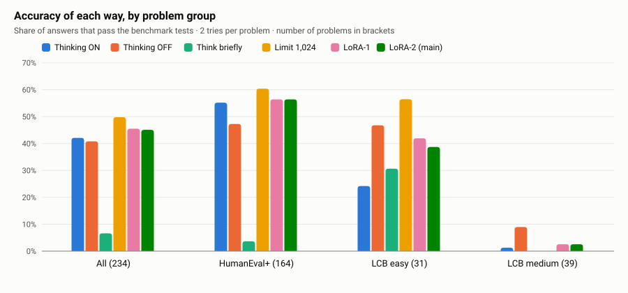
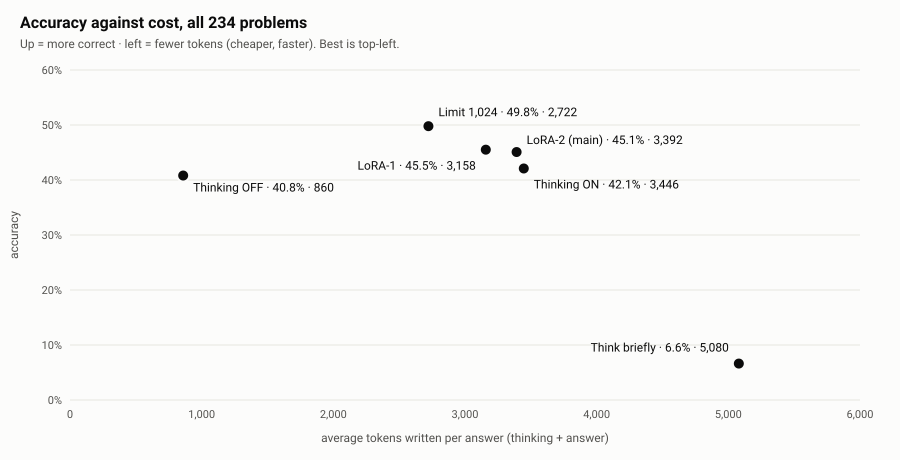
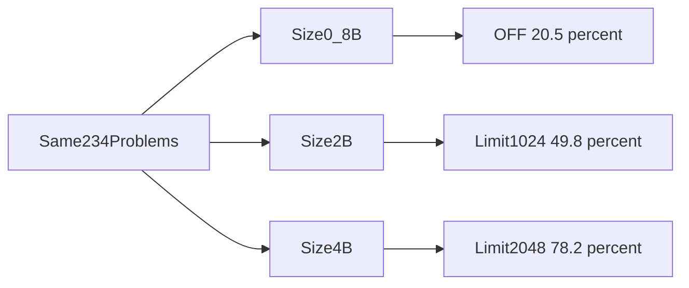

# Stop Overthinking, Keep Passing the Tests

Easy-language thesis. One file.
The short chapters live beside this file.
The official science write-up is [../thesis/THESIS.md](../thesis/THESIS.md).
Numbers come from the checked results, not from memory.

A *token* is a small piece of text, about three quarters of a word.

## Contents

1. [The thesis in one page](#the-thesis-in-one-page)
2. [All the problems, then the scores](#all-the-problems-then-the-scores)
3. [Who should use this, and why](#who-should-use-this-and-why)
4. [The problem, the gap, and the question](#the-problem-the-gap-and-the-question)
5. [How we did it](#how-we-did-it)
6. [The datasets, and how we checked them](#the-datasets-and-how-we-checked-them)
7. [The results](#the-results)
8. [Why the limit works, and training does not](#why-the-limit-works-and-training-does-not)
9. [What to do, and what we did not prove](#what-to-do-and-what-we-did-not-prove)
10. [All the answers](#all-the-answers)
11. [Words used in this folder](#words-used-in-this-folder)

---

# The thesis in one page

Small code models often "think" for a long time.
A free stop on that thinking beat training them to think shorter.

You are in the **CONCLUSION** box.
The lists below are the whole study on one page.

## Everyday example

Imagine three exam papers and two homework piles.
You mark each exam paper on its own.
You do not add the three marks into one score.
The homework is what we used to train the add-on.
The homework is not the exam.

## Every problem, in one count

```text
TEST  (three lists, marked apart)
  234  first exam      easy functions + contest
+  40  extra contest   a small later check
+ 190  more contest    a bigger later check
─────
  464  problems we can name

TRAIN  (the add-on only)
  100  easy functions     →  LoRA-1
  280  easy + old contest →  LoRA-2
       200 + 80
       157 of the 280 had a short correct answer we kept
```

**464 is a count of problems.**
It is not one accuracy.
49.8% and 78.2% stay on the 234.

The pictures and the full stats are in [10-all-counts.md](10-all-counts.md).

A *token* is a small piece of text, about three quarters of a word.
A *LoRA* is a small add-on we train on top of the model.
We do not retrain the whole model.

| Add-on | Training problems | What we kept | Where it was used |
|---|---|---|---|
| LoRA-1 | **100** easy functions | 37 on 0.8B, 73 on 4B | 0.8B, 2B, and 4B |
| LoRA-2 | **280** (200 easy + 80 older contest) | **157** (133 + 24) | 2B main exam only |

## Scores on the 234

```text
How often the answers pass the tests (2B, higher is better)

Limit 1,024     ██████████████████████████  49.8%   best, and proven
LoRA-1 (from 100) ███████████████████████   45.5%
LoRA-2 (from 280) ███████████████████████   45.1%   not shorter
Thinking ON     ██████████████████████      42.1%   what we compare against
Thinking OFF    █████████████████████       40.8%   about 4× fewer tokens
"Think briefly" ███                          6.6%   the wording confused it
```

| Size | Best free way | Score | Trained add-on |
|---|---|---|---|
| 0.8B (1 try) | Thinking OFF | 20.5% | LoRA-1 17.9% |
| 2B | Limit 1,024 | 49.8% | LoRA-1 45.5% · LoRA-2 45.1% |
| 4B (2 tries) | Limit 2,048 | 78.2% | LoRA-1 69.9% |

The trained add-on never beat the best free way on this exam.

## Scores on the extra 40

A free way still wins.
Thinking OFF was best, or it tied the limit.

| Size | On these 40 | Thinking ON | Trained add-on |
|---|---|---|---|
| 0.8B (1 try) | OFF 5.0% (2/40) | 0% | LoRA-1 0% |
| 2B (2 tries) | OFF 12.5% (10/80) | 0% | not run |
| 4B (2 tries) | OFF 46.2%, tied with limit 2,048 | 18.8% | not run |

## Scores on the 190

One try each. A free way still wins.
The winner matches the first exam.

| Size | On these 190 | Trained add-on |
|---|---|---|
| 0.8B | OFF 9.5% (18/190) | LoRA-1 7.9% (from the 100) |
| 2B | Limit 1,024 at 31.1% (59/190) | skipped |
| 4B | Limit 2,048 at 69.5% (132/190) | LoRA-1 46.3% (from the 100) |

The 2B add-on was skipped. Colab printed this line:

```text
lora1  SKIP — no weights at /content/thesis/results/mini/lora/lora100
```

The clock still said GO. About 11 hours were left.
The file `adapter_model.safetensors` was not in that folder.
Git keeps the 0.8B and 4B weight files. It does not keep this 2B file.
Those two add-ons did load. Colab printed "LoRA loaded" for both.
The free 2B ways had already been graded.
That Colab session was later deleted, so this cell stays empty.

On 4B medium only, OFF is 44.4% and the limit is 38.9%.
The limit still wins all 190, because easy is 88.1% against OFF at 80.5%.

The full tables are in the results chapter below.

## Why

Most very long answers were loops.
The model repeated the same lines until it ran out of room.
A thinking limit cuts the loop and forces an answer.
Training on 100 or on 280 short answers does not teach the model how to get unstuck.

## One line

For these small code models, try thinking OFF or a short thinking limit first.
Train only if those free ways are not enough.

---

# All the problems, then the scores

This page is the whole pile in one place.
The pictures come first. The tables sit under them.

You are in the **RESULTS** box.
Each test list keeps its own score.
464 is a count. It is not one accuracy.

## Everyday example

Three exam papers sit in one folder.
Two homework piles sit next to them.
You can count every sheet.
You still mark each exam on its own.

## The count



| Pile | How many | What it is |
|---|---|---|
| First exam | **234** | Easy functions plus contest problems |
| Extra contest | **40** | Later check |
| More contest | **190** | Bigger later check. 118 easy, 72 medium |
| **Tests in total** | **464** | 234 + 40 + 190. A count, not a blended score |
| LoRA-1 pool | **100** | Easy functions used to train the small add-on |
| LoRA-2 pool | **280** | 200 easy functions + 80 older contest problems |
| LoRA-2 kept | **157** | Short correct answers actually used. 133 + 24 |

49.8% and 78.2% stay on the 234.

## Best free score on each list



| List | 0.8B | 2B | 4B |
|---|---|---|---|
| Exam 234 | OFF **20.5%** | Limit 1,024 **49.8%** | Limit 2,048 **78.2%** |
| Extra 40 | OFF **5.0%** (2/40) | OFF **12.5%** (10/80) | OFF **46.2%**, tied with limit 2,048 |
| More 190 | OFF **9.5%** (18/190) | Limit 1,024 **31.1%** (59/190) | Limit 2,048 **69.5%** (132/190) |

A free way wins on every list.
The winner on the 190 matches the first exam.

## The 190, way by way



| Way | 0.8B | 2B | 4B |
|---|---|---|---|
| Thinking OFF | 9.5% (18/190) | 24.7% (47/190) | 66.8% (127/190) |
| Thinking ON | 1.1% (2/190) | 13.7% (26/190) | 38.9% (74/190) |
| Best limit | 4.2% at 512 | **31.1%** at 1,024 | **69.5%** at 2,048 |
| LoRA-1 | 7.9% (15/190) | skipped | 46.3% (88/190) |

The 2B add-on has no bar.
Colab printed `SKIP — no weights at /content/thesis/results/mini/lora/lora100`.
The clock said GO. About 11 hours were left.
That Colab session was later deleted, so this cell stays empty.
The other scores were already saved.

On 4B medium only, OFF is 44.4% (32/72) and the limit is 38.9% (28/72).
The limit still wins all 190, because easy is 88.1% (104/118) against OFF at 80.5% (95/118).

The run took **7.9 hours**. One try. Seed 3407.

## What this does not say

The three lists are not one exam.
Do not average 49.8%, 12.5%, and 31.1% into a new 2B score.
The 4B lead on the 190 is 5 answers (132 vs 127).
We did not draw error bars on the 40 or the 190.

The same page on its own is [10-all-counts.md](10-all-counts.md).

---

# Who should use this, and why

A small code model with a thinking switch is enough for many easy Python tasks.
A free limit, or thinking turned off, is the first thing to try.

## Everyday example

You have a laptop, or one rented graphics chip.
You want a function that checks a list of numbers.
You do not want to send that code to a giant cloud model.
You also do not want the small model to talk to itself for pages.

That is the job this study is about.

## Who it is for

1. **A student or a small team** writing easy or medium Python.
2. **A lab with one GPU.** A GPU is the chip that runs the model. Our models are about 0.8, 2, and 4 billion numbers. They fit on one Colab GPU.
3. **Someone who must keep code on their own machine.** A small model can run locally. The code does not have to leave the building.
4. **Someone choosing a setting before they pay for training.** Training costs time. The free settings already won here.

## Why people should use the free way

On the 2 billion model, stopping thinking at 1,024 tokens solved **49.8%** of answers.
Normal thinking solved **42.1%**.
The gap is **+7.7 points**.
The error bar is **[+4.3, +11.3]**.
It sits fully above zero, so the gap is proven on this test.

The trained add-on did not think shorter.
Its length was **x1.00** of normal thinking.
Its accuracy was **45.1%**.
The gain over normal thinking was **+3.0 points**, and that gain is not proven.

So the useful product is not a new trained model.
It is a simple rule: **cap the thinking, or turn it off.**

## Why this is efficient

A *token* is a small piece of text, about three quarters of a word.

| Way on the 2B model | Tokens per answer | Accuracy |
|---|---|---|
| Thinking OFF | **860** | 40.8% |
| Limit 1,024 | **2,722** | **49.8%** |
| Normal thinking | **3,446** | 42.1% |
| Trained add-on (LoRA-2) | **3,392** | 45.1% |

Thinking OFF uses about **4 times fewer tokens** than normal thinking (860 against 3,446).
Accuracy stays close.
The limit uses **21% fewer tokens** than normal thinking (2,722 against 3,446) and scores higher.

The saving is real because long answers were mostly **loops**.
The model repeated itself.
A limit stops that repeat.
Careful long thinking was not the main waste.
Finished answers were already short.
On HumanEval+, the middle finished thinking length was **672** tokens.

## Benefits

- **Higher accuracy for free** on the 2B and 4B models, by using a thinking limit.
- **Much cheaper answers** if you turn thinking off, with only a small accuracy drop on the 2B model.
- **No training step** for the winning way. You change one setting.
- **A size rule you can copy:** OFF on the tiny model, about 1,024 tokens on 2B, about 2,048 tokens on 4B.
- **Honest failure on hard-for-this-model problems.** Medium LiveCodeBench stayed near zero. You know not to trust these models there.

## Why not a giant model

```text
Easy Python on one GPU
        │
        ├─ Small model + thinking limit     fits, private, already strong on easy tasks
        └─ Giant model                      more machine, more tokens, code may leave your computer
```

**Small GPU.**
We ran 0.8B, 2B, and 4B on one Colab A100.
A giant model needs a much bigger machine.
For a school lab, that cost is the whole point.

**Easy problems.**
These tests are easy functions and easy or medium programs.
A 4B model with a 2,048-token thinking limit already reached **78.2%**.
A giant model would spend more time and money on problems this size can already attempt.
We did **not** test a model bigger than 4B.
We did **not** test hard contest problems.
On those, a bigger model may still be the right tool.
We did grade 40 newer easy and medium contest problems.
On those, thinking OFF matched or beat the limit.
The table is in the results chapter below.

**Keep code private.**
If the model runs on your own computer, the source code stays with you.
A giant cloud model often means sending the problem out.
We did **not** run a security test.
We did **not** measure leaks or attacks.
This is advice from the setup, not a measured security result.

## What we checked, and what we did not

| Checked | Not checked |
|---|---|
| Accuracy and tokens on 234 code problems | Privacy attacks or secret leaks |
| A later 40 contest problems | 2B and 4B training on those 40 |
| Three sizes in one family (Qwen3.5) | Models bigger than 4B |
| Real benchmark tests, not a human reading the code | Hard problems and math |
| A free limit beats the trained add-on on each size | Every possible "think briefly" wording |

---

# The problem, the gap, and the question

We are in this box:

```text
PROBLEM → GAP → QUESTION → HYPOTHESIS → EXPERIMENT → … → CONCLUSION
   ▲         ▲        ▲           ▲
  here     here     here        here
```

## 1. The problem

New code models "think" before they answer.
Thinking means they write notes to themselves, then the code.
Thinking can help.
It also costs tokens and time.
A *token* is a small piece of text, about three quarters of a word.

On a small model, those notes are often far longer than the code.
People call that overthinking.
Our later results show a sharper name: **getting stuck in a loop.**

Everyday picture: the student writes five pages for "2 + 2", then copies the same paragraph until the bell rings.

## 2. Two ways to fix it

```text
Question
   │
   ├─ Free ways (no training)
   │     1. Thinking OFF
   │     2. Stop thinking at a fixed length
   │     3. Ask in words: "think briefly"
   │
   └─ Training
         Teach a small add-on (a LoRA) using the model's own shortest correct answers
```

A *LoRA* is a small add-on.
The rest of the model stays frozen.
Free ways need no training.
Training needs GPU time and careful data.

## 3. The gap

Other papers have trained models to think shorter.
Other papers have tried a thinking switch or a length cap.
We did not find a study that did **both** on one small code model that has a real ON/OFF switch.
That comparison is the gap.
If a free switch is as good as training, training is not worth it.

## 4. The question

**On a small model with a thinking switch, is training it to think shorter better than the free options?**

## 5. What we expected

We wrote this down **before** the main run.

| Part | We needed | Plain meaning |
|---|---|---|
| H1 | Thinking length ≤ 0.75× normal thinking | It should get clearly shorter |
| H2 | Accuracy loss ≤ 3 points | It should not get much worse |
| H3 | Better than each free way | Training should beat OFF, the limit, and "think briefly" |

What would support it: shorter thinking, accuracy held, and a win over the free ways.
What would reject it: thinking not shorter, or a free way that scores higher.

## 6. What we actually did, in one line

We used **Qwen3.5-2B** on **234** code problems.
We compared six ways.
Then we repeated the idea on **0.8B** and **4B**.

The full method is in [03-how-we-did-it.md](03-how-we-did-it.md).
The scores are in [05-results.md](05-results.md).

---

# How we did it

We kept the model, the problems, and the rules the same.
Only the way of answering changed.
That is what makes the comparison fair.

## Everyday example

Six students sit the same exam.
Same questions.
Same time room.
One student is told "do not plan".
One may plan freely.
One is told "plan in one short note".
One must stop planning after one page.
Two studied from their own best short answers.
We mark every script with the same hidden tests.

## The model

| | |
|---|---|
| Main model | Qwen3.5-2B (`unsloth/Qwen3.5-2B`) |
| Also tested | Qwen3.5-0.8B and Qwen3.5-4B |
| Thinking switch | ON or OFF is a real setting, not only a sentence in the prompt |
| Computer | Google Colab A100 GPU |

We changed from an earlier Gemma plan to Qwen because the small Qwen models fit, they have a thinking switch, and the Colab tools could train them.
That choice is decision 53 in [../DECISIONS.md](../DECISIONS.md).

## The six ways (main 2B run)

```text
Same model, same 234 problems
        │
        ├─ 1. Thinking OFF
        ├─ 2. Thinking ON          ← what we compare against
        ├─ 3. "Think briefly"      ← one extra sentence
        ├─ 4. Thinking limit       ← stop notes at 1,024 tokens
        ├─ 5. LoRA-1               ← small early add-on
        └─ 6. LoRA-2               ← main trained add-on
```

Ways 1 to 4 are free.
Ways 5 and 6 need training.

**Why 1,024?**
In the small early test, the trained model thought for about 1,000 tokens.
The limit asks a fair question: is a hard cut as good as training?

**Why LoRA-2 is the main trained way?**
We named it **before** the run.
That stops us from picking whichever add-on looks better afterwards.

## How an answer is marked

```text
model text → take the last Python block → run the benchmark tests → pass or fail
```

An answer **passes only if it passes every test**.
One failed test means fail.
If thinking never finishes, there is no code, so that answer fails.
The tests run in a separate process with a time limit.
They never run inside the notebook.

Before we graded model answers, we graded the official correct solutions on 30 HumanEval+ problems and 20 MBPP+ problems.
They all passed.
So the checker itself was working.

**Accuracy** = answers that passed ÷ all answers.

Worked example for normal thinking on all 234 problems:

```text
234 problems × 2 tries = 468 answers
passed: 197
197 ÷ 468 = 42.1%
```

**Points** are the gap between two accuracies.
49.8% minus 42.1% is **+7.7 points**.
That is not "7.7 percent more" in the relative sense.
We always report points.

The error bars come from comparing the **same problems** before and after.
We resample problems 2,000 times with seed 3407.
If the bar does not include 0, we call the gap proven on this test.

## Fair rules, fixed before the run

| Rule | Value | Why |
|---|---|---|
| Same problems | all 234 | a paired comparison |
| Same token room | 4,096 on HumanEval+, 8,192 on LiveCodeBench | nobody gets extra room |
| Same sampling | temperature 0.6, top-p 0.95, top-k 20 | only the way changes |
| Same prompt | except one sentence for "think briefly" | |
| Tries | 2 on the main 2B run | the GPU budget |
| Seeds | fixed, try 1 uses 3407 | anyone can repeat it |
| Grading | the benchmark's own tests | not a human looking at code |
| Raw answers | saved word for word | re-grading is free |

We later gave normal thinking more room (16,384 tokens) on answers that had been cut off.
That check is in the results.
It shows the room limit did cost a little on easy functions.
It did not erase the limit's win.

## The small test before the real run

On 100 other easy MBPP+ problems, the early add-on scored **65%** against **50%** for normal thinking.
It also used **41% fewer tokens**.
That was a green light to run the real test.
The real test then asked whether the same trick works on **different** problems.

## What the later size runs changed

| | 0.8B | 2B main | 4B |
|---|---|---|---|
| Tries | 1 | 2 | 2 |
| Limits | 512 and 1,024 | 1,024, plus later 512 and 2,048 | 512, 1,024, 2,048, 4,096 |
| Trained add-on | LoRA-1 only | LoRA-1 and LoRA-2 | LoRA-1 only |
| "Think briefly" | not repeated | yes | not repeated |

The 2B limit of 2,048 is a lean fill-in with **1 try**.
Say that whenever you quote **46.6%**.

---

# The datasets, and how we checked them

We did not invent the problems.
We used public code tests, then checked that training problems were not copies of test problems.

## Everyday example

A teacher writes the exam in September.
The homework is from last year's book.
Before the exam, someone checks that no homework question is the same as an exam question.
If one is too close, it is thrown out.

That check is the overlap check.

## The test set (234 problems)

The list was **fixed on 2026-09-20**, before any score.

```text
234 test problems
 ├─ HumanEval+      164   easy     finish one Python function
 └─ LiveCodeBench    70   from February 2025 on
      ├─ easy         31           read input, print output (a few are class methods)
      └─ medium       39           the same job, harder
```

## Later lists, counted apart

The first exam stays 234.
Two later contest lists were marked on their own sheet.


| Pile | How many |
|---|---|
| First exam | 234 |
| Extra contest | 40 |
| More contest | 190 (118 easy, 72 medium) |
| Tests in total | **464** |
| LoRA-1 pool | 100 |
| LoRA-2 pool | 280, of which **157** were kept |

464 is a count. It is not one score.
The charts and the stats are in [10-all-counts.md](10-all-counts.md).

Hard LiveCodeBench problems were left out.
A 2 billion model solves almost none of them.
They could not show a difference between ways.

| Set | What the model must do | How a test works |
|---|---|---|
| HumanEval+ | Complete one function | A call such as `has_close_elements([1.0, 2.8, 3.0], 0.3)` plus the right result. HumanEval+ adds many more tests than the old HumanEval set. |
| LiveCodeBench | A full program, or a class method | An input text goes in. The program must print the exact output. We use up to 20 tests per problem. |

Time limits: 30 seconds for a HumanEval+ test program, 20 seconds per LiveCodeBench test.

The question text was the same for every way, except the one extra sentence for "think briefly".

```text
HumanEval+:    "Complete this Python function. Answer with one Python code block only,
                containing the complete function."  + the function to finish

LiveCodeBench: the problem text + "Write a complete Python program. It reads from
                standard input and prints the answer. Answer with one Python code block only."
                (class problems ask you to finish the given class instead)
```

## A real HumanEval problem

This is **HumanEval/0**, the first test problem.
The text below is copied from our saved answer file
`results/2026-09-24-thesis-run/test-off-he.jsonl`.
Thinking was OFF.
The model returned the function it was asked to finish, including the official description.

```python
from typing import List


def has_close_elements(numbers: List[float], threshold: float) -> bool:
    """ Check if in given list of numbers, are any two numbers closer to each other than
    given threshold.
    >>> has_close_elements([1.0, 2.0, 3.0], 0.5)
    False
    >>> has_close_elements([1.0, 2.8, 3.0, 4.0, 5.0, 2.0], 0.3)
    True
    """
```

The examples in the quotes are part of the problem.
The hidden HumanEval+ tests are stricter.
An answer passes only if **every** test passes.
On the main 2B run, the limit, LoRA-1, and LoRA-2 each solved HumanEval/0 on both tries.
Normal thinking solved it on one try.
The full row is in [../results/full-results/FULL-RESULTS.md](../results/full-results/FULL-RESULTS.md).

## A real LiveCodeBench problem

The question body is **not stored in this git repo**.
It lives in the LiveCodeBench file the notebook downloads.
We can still show the problem we actually graded.

| | |
|---|---|
| Id | `lcb/3705` |
| Level | easy |
| Shape in our saved answer | a class method `largestInteger(self, nums, k)` |
| Date rule | test problems are from **after 31 January 2025** |
| Score on the main 2B run | **no way** solved it (0 of 2 tries each) |

That zero is useful.
It shows an easy label does not mean every model passes.
66 of the 234 problems were solved by no way at all.

The instruction we add is in `scripts/lcb_data.py`.
For a class problem it says: complete the given Python class, and answer with one code block.

## The training set

Training problems are **not** the test problems.
LoRA-1 used a pool of **100** easy functions.
LoRA-2 used the bigger pool below.

| Pool | Problems | Why this pool |
|---|---|---|
| MBPP+ | 200 | Easy Python functions with strong tests. The early test showed they work. |
| Older LiveCodeBench | 80 (40 easy + 40 medium) | Same kind of task as the LiveCodeBench exam, but from release v1, **before February 2025**, so they cannot be the test problems. |

```text
200 MBPP+  +  80 older LiveCodeBench  =  280 problems
        │
        ▼
4 thinking-ON tries each
        │
        ▼
keep the shortest correct answer
(never shorter than half the middle correct length)
        │
        ▼
157 training examples  →  LoRA-2
133 from MBPP+   +   24 from older LiveCodeBench
```



| | MBPP+ | Older LiveCodeBench |
|---|---|---|
| Problems | 200 | 80 |
| Answers (4 tries) | 800 | 320 |
| Correct answers | 357 (44.6%) | 44 (13.8%) |
| Kept examples | 133 | 24 |
| Middle thinking length of kept examples | 515 tokens | **4,709 tokens** |

The LiveCodeBench training examples were already long.
There was almost nothing short to learn there.
The kept length divided by the average correct length was **0.83** on MBPP+ and **0.99** on older LiveCodeBench.

LoRA-2 trained on those 157 examples for 3 passes.
That took about 6 minutes.
The loss fell from about 0.25 to about 0.16, so the add-on did learn the examples.
The later chapter explains why that still did not shorten test thinking.

## The overlap check

No test problem may appear in the training data.

The script `scripts/overlap_check.py` compares every training problem with every test problem.
It removes a training problem if:

- the function name is the same, or
- they share 30% or more of their 5-word pieces.

**Main 2B run.**
One training problem was removed after it had a correct answer: **`Mbpp/309`**.
That is the removal named in the full results page.

**Later size runs.**
The saved files `results/0.8b/raw/overlap-exclude.json`, `results/4b/raw/overlap-exclude.json`, `results/2b-limit512/raw/overlap-exclude.json`, and `results/2b-limit2048/raw/overlap-exclude.json` list four ids:

- `Mbpp/119`
- `Mbpp/309`
- `Mbpp/626`
- `Mbpp/99`

Those files belong to the later notebooks, not to a second story about the main run.
The main written result still names **`Mbpp/309`** as the problem removed from LoRA-2's kept set.

## What "valid" means here

| Check | Result |
|---|---|
| Test list fixed before scores | Yes, 2026-09-20, 234 problems |
| Train and test are different pools | Yes. MBPP+ and older LiveCodeBench versus HumanEval+ and LiveCodeBench from February 2025 on |
| Overlap script ran | Yes. Main run removed `Mbpp/309` |
| Grader checked on official solutions | Yes. 30 HumanEval+ and 20 MBPP+ official solutions passed |
| Answers judged by eye | No. Real tests only |
| Every test problem listed with scores | Yes, in the full results appendix |

We do **not** claim the model has never seen HumanEval or MBPP on the internet.
Qwen3.5 does not publish a cutoff date that would prove that.
The February 2025 LiveCodeBench cut is a **recent-problem** filter, not a proof the model has never seen the text.

---

# The results

The free thinking limit was the most accurate way on the 2B model.
Training did not make thinking shorter.
The same pattern holds on 0.8B and 4B: a free way wins, and the best free way grows with size.

## Everyday example

You time six routes to school.
One route is "don't plan, just walk".
One route is "plan, but stop the plan after one page".
The short plan wins.
The fancy study notes do not beat it.

## Where we are

```text
PROBLEM ✅ → GAP ✅ → QUESTION ✅ → HYPOTHESIS ✅ → EXPERIMENT ✅ → DATA ✅ → RESULTS ← here
```

Numbers below are copied from [../results/full-results/FULL-RESULTS.md](../results/full-results/FULL-RESULTS.md)
and [../results/SIZE-COMPARISON.md](../results/SIZE-COMPARISON.md).

## Main 2B scores

234 problems, 2 tries, 468 answers per way.



| Way | Passed | Accuracy | Versus normal thinking |
|---|---|---|---|
| Thinking ON | 197 / 468 | **42.1%** | — |
| Thinking OFF | 191 / 468 | **40.8%** | −1.3 points [−6.6, +4.3] |
| Think briefly | 31 / 468 | **6.6%** | −35.5 points [−41.2, −29.3] |
| Limit 1,024 | 233 / 468 | **49.8%** | **+7.7 points [+4.3, +11.3]** |
| LoRA-1 | 213 / 468 | **45.5%** | +3.4 points [−0.4, +7.7] |
| LoRA-2 (main) | 211 / 468 | **45.1%** | +3.0 points [−1.1, +7.3] |

Only the limit's gain over normal thinking is proven.
Its error bar is fully above zero.
LoRA-2's +3.0 point gain includes zero, so we cannot prove it.



## By problem group (2B)

| Way | HumanEval+ (164) | LiveCodeBench easy (31) | LiveCodeBench medium (39) |
|---|---|---|---|
| Thinking ON | 55.2% | 24.2% | 1.3% |
| Thinking OFF | 47.3% | 46.8% | **9.0%** |
| Think briefly | 3.7% | 30.6% | 0.0% |
| Limit 1,024 | **60.4%** | **56.5%** | 0.0% |
| LoRA-1 | 56.4% | 41.9% | 2.6% |
| LoRA-2 | 56.4% | 38.7% | 2.6% |

On easy functions, thinking helps: turning it off costs **7.9 points** [−14.6, −1.2].
On easy LiveCodeBench, normal thinking is weak, and the limit gains **+32.3 points** [+17.7, +46.8].
On medium LiveCodeBench, almost nothing works.
Only thinking OFF solves a few (**9.0%**).

## Did training do what we asked?

| Part | Needed | Result | Verdict |
|---|---|---|---|
| H1 shorter thinking | ≤ 0.75× | **x1.00** [0.94, 1.06] | No |
| H2 accuracy held | loss ≤ 3 points | **+3.0** [−1.1, +7.3] | Yes (it did not get worse) |
| H3 beats the limit | higher than the limit | **−4.7** [−9.0, −0.2] | No. The limit is better |

The research answer on 2B is **no**.
Training was not better than the free options.

## Tokens, the real cost

| Way | All tokens (average) | Thinking versus ON |
|---|---|---|
| Thinking ON | **3,446** | — |
| Thinking OFF | **860** | no thinking notes |
| Limit 1,024 | **2,722** | x0.26 of ON's thinking |
| LoRA-1 | 3,158 | x0.87 [0.81, 0.93] |
| LoRA-2 | 3,392 | **x1.00** [0.94, 1.06] |

The limit's thinking notes are short.
After the cut, it still writes a long answer part (1,879 tokens on average).
Count **all** tokens and the saving is **21%**, not 74%.

## The 2B limit curve

Later fill-ins added two more limits on the same 234 problems.

```text
Limit 512     45.1%    (2 tries)
Limit 1,024   49.8%    (2 tries)   ← peak
Limit 2,048   46.6%    (1 try)
```

A longer cap than 1,024 did **not** help this 2B model.
Say that 46.6% is **one try**.
The other two cells are two tries.

## Three sizes



| Way | 0.8B (1 try) | 2B | 4B (2 tries) |
|---|---|---|---|
| Thinking OFF | **20.5%** | 40.8% | 69.7% |
| Thinking ON | 7.3% | 42.1% | 64.3% |
| Limit 512 | 17.5% | 45.1% | 75.4% |
| Limit 1,024 | 13.2% | **49.8%** | 76.5% |
| Limit 2,048 | — | 46.6% (1 try) | **78.2%** |
| Limit 4,096 | — | — | 76.7% |
| LoRA-1 | 17.9% | 45.5% | 69.9% |

| Size | Best free way | Beats LoRA-1? |
|---|---|---|
| 0.8B | OFF at 20.5% | Yes (17.9%) |
| 2B | Limit 1,024 at 49.8% | Yes (45.5%) |
| 4B | Limit 2,048 at 78.2% | Yes (69.9%) |

Normal thinking hits the wall less often as the model grows: **78%** cut off on 0.8B, about **41%** on 2B, **28%** on 4B.
Bigger is more accurate on every way.
The free winner still changes with size.
LoRA-1 still loses.

## A later check: 40 newer contest problems

The first exam stays **234** problems.
The scores above do not change.

After that exam, we graded **40** more LiveCodeBench problems.
The dates run from 30 November 2024 to 4 January 2025.
17 are easy. 23 are medium.
None are in the exam. None are in training.
This list has no easy function questions.
That is why every score here is lower.

The run took **3.7 hours** on an A100, under a 4.5 hour cap.

| Way | 0.8B (1 try) | 2B | 4B (2 tries) |
|---|---|---|---|
| Thinking OFF | **5.0%** (2/40) | **12.5%** (10/80) | **46.2%** (37/80) |
| Thinking ON | 0% (0/40) | 0% (0/80) | 18.8% (15/80) |
| Limit 512 | 0% | 6.2% (5/80) | not run |
| Limit 1,024 | 0% | 8.8% (7/80) | not run |
| Limit 2,048 | — | 7.5% (3/40, 1 try) | **46.2%** (37/80) |
| Think briefly | — | 5.0% (4/80) | — |
| LoRA-1 | 0% (0/40) | not run | not run |

On these 40, a free way still wins.
Thinking OFF wins on 0.8B and on 2B.
On 4B, OFF and the 2,048 limit tie.
Thinking ON is the weak way.
It hit the token wall on **92%** of 2B answers and **81%** of 4B answers.

The 2B lead for OFF is **3 answers out of 80**.
We have not drawn error bars, so this is not a new proven winner.
It is enough to say the 1,024 limit did not win this list.

On 4B the tie splits by difficulty:

| 4B way | Easy (34 answers) | Medium (46 answers) |
|---|---|---|
| Thinking OFF | **73.5%** | 26.1% |
| Limit 2,048 | 67.6% | **30.4%** |
| Thinking ON | 41.2% | 2.2% |

2B training and 4B training did not run on these 40.
The 2B weight files were missing, so those ways were skipped.
4B stopped after thinking ON.
The next job would have broken the spare half hour.
On 0.8B, training scored **0 out of 40**. OFF still won.

These 40 stay in their own table.
The first exam was locked before anyone saw a score.
Adding them into 49.8% would hide this result, because the old 234 would still dominate the average.

The saved scores are in [../results/extra/SUMMARY.md](../results/extra/SUMMARY.md).

## A bigger later check: 190 contest problems

After the 40, we graded **190** more LiveCodeBench problems.
118 are easy. 72 are medium.
Dates run from 26 August 2023 to 23 November 2024.
None are in the exam, the extra 40, or training.
This list is contest problems only, so the scores are lower than the 234.

The run took **7.9 hours** on one GPU, under a cap of about 14.8 hours.
One try each.


| Way | 0.8B | 2B | 4B |
|---|---|---|---|
| Thinking OFF | **9.5%** (18/190) | 24.7% (47/190) | 66.8% (127/190) |
| Thinking ON | 1.1% (2/190) | 13.7% (26/190) | 38.9% (74/190) |
| Best limit | 4.2% at 512 | **31.1%** at 1,024 | **69.5%** at 2,048 |
| LoRA-1 | 7.9% (15/190) | skipped | 46.3% (88/190) |

A free way still wins.
The winner is the same one as the first exam: OFF, then limit 1,024, then limit 2,048.

The 40 had said OFF wins or ties.
That was a small pile. Here the exam winner comes back.
The 4B lead is only **5 answers** (132 vs 127).
We have not drawn error bars, so do not call that gap proven.

On 4B the full-list win splits by difficulty:

| 4B way | Easy (118) | Medium (72) |
|---|---|---|
| Thinking OFF | 80.5% (95) | **44.4%** (32) |
| Limit 2,048 | **88.1%** (104) | 38.9% (28) |
| Thinking ON | 59.3% (70) | 5.6% (4) |
| LoRA-1 | 67.8% (80) | 11.1% (8) |

The 2B add-on was skipped. Colab found no weight file at `results/mini/lora/lora100`.
The clock said GO. That session was later deleted, so the cell stays empty.
0.8B training scored 7.9%. 4B training scored 46.3%.
Both lost to a free way.

These 190 stay in their own table.
Adding them into 49.8% would hide both results.

The saved scores are in [../results/more/SUMMARY.md](../results/more/SUMMARY.md).
The count charts are in [10-all-counts.md](10-all-counts.md).

## The early test, for contrast

On 100 easy MBPP+ problems that look like the training data, LoRA-1 scored **65%** against **50%** and used **41% fewer tokens**.
On HumanEval+, which is a different easy-function set, that shortening almost disappeared (x0.94).
Training helped on problems like its homework.
It did not travel cleanly to the exam.

---

# Why the limit works, and training does not

The model was not mainly thinking too carefully.
It was getting stuck.
A limit cuts the stuck text.
Training on short finished answers never shows the model how to escape a loop.

## Everyday example

A student who knows the answer writes half a page and stops.
A student who is stuck copies the same sentence until the paper is full.
Showing them a neat short essay does not teach them to notice the copy loop.
Taking the pen away after one page does.

## The loop counts


| Way | Cut off | Of those, stuck in a loop |
|---|---|---|
| Thinking ON | 190 of 468 (**40.6%**) | **69.5%** |
| Thinking OFF | 33 of 468 (7.1%) | 81.8% |
| Think briefly | 432 of 468 (92.3%) | 40.3% |
| Limit 1,024 | 121 of 468 (25.9%) | 76.9% |
| LoRA-1 | 168 of 468 (35.9%) | 83.9% |
| LoRA-2 | 192 of 468 (41.0%) | **88.5%** |

Training did not reduce loops.
LoRA-2's unfinished answers were loops even more often than normal thinking.

A real loop, from thinking ON on HumanEval/1, cut off at 4,096 tokens.
This is the end of the saved notes.
The same sentences return again and again:

```text
The implementation requires careful tracking of parentheses groups...
By iterating through the string, I can identify balanced groups...
The implementation requires careful tracking of parentheses groups...
By iterating through the string, I can identify balanced groups...
```

## Finished answers were already short

On HumanEval+, the middle thinking length of answers that **finished** was **672** tokens for normal thinking.
The long average (1,564 thinking tokens) is pulled up by the cut-off loops.
So there was little "too long but finished" thinking for the add-on to copy.


## Why the training examples could not fix this

```text
Shortest correct answer  →  a finished, fairly short note
What the model does wrong on the test  →  a loop that never finishes
```

You cannot teach "get unstuck" with examples that never get stuck.

Two extra facts from the training funnel:

1. On older LiveCodeBench, only **1 of 160** medium tries was correct.
   The kept examples there had a middle length of **4,709** tokens.
   LoRA-2 then thought **longer** on LiveCodeBench than LoRA-1.
2. On MBPP+, the early add-on really did get shorter (x0.59) and more accurate (65% vs 50%).
   Those problems look like the homework.
   HumanEval+ is a different set of easy functions, and the shortening faded.

The add-on did learn something.
Its training loss fell from about 0.25 to about 0.16.
It learned the examples it was given.
Those examples were the wrong lesson for loops.

## Why a limit is efficient

| | Thinking notes | All tokens | Accuracy |
|---|---|---|---|
| Normal thinking | 3,262 average | 3,446 | 42.1% |
| Limit 1,024 | 843 average | 2,722 | 49.8% |
| Thinking OFF | 0 | 860 | 40.8% |

The limit spends fewer tokens **and** passes more tests on this 2B run.
That is the efficiency claim we checked.

It is not magic.
On medium LiveCodeBench the limit solved **nothing** (0 of 78 answers).
If the model has not found the idea by 1,024 tokens, cutting it does not create the idea.
On those problems, thinking OFF was the least bad free way (9.0%).

Giving normal thinking 16,384 tokens raised HumanEval+ from 53.7% to 59.1% on the cut-off retry.
The limit was still at 60.4%, and it used far less room.
More room did not rescue open thinking.

## Why "think briefly" failed

The prompt already said "answer with one Python code block only".
The extra sentence said "think briefly, then give the answer".
The model argued with the two rules and often never finished.
Only **36 of 468** brief answers finished.
This is a result for **this wording**, not for every way of asking for a short answer.

A snippet from HumanEval/0, try 1:

```text
"Answer with one Python code block only" suggests I should not include filler.
"Think briefly... then give the answer." suggests I should include the thinking.
Wait, if I output thinking text, is it "one Python code block only"?
```

## Why the best cap grows with size

A weak student (0.8B) does best when told not to plan.
Open thinking cut off **78%** of its answers, and accuracy fell to **7.3%**.
OFF won at **20.5%**.

A mid student (2B) can use about 1,024 tokens of notes.
512 helps (45.1%).
2,048 does not beat 1,024 (46.6% vs 49.8%).

A stronger student (4B) can use about 2,048 tokens.
That cap won at **78.2%**.
Open thinking still lost (64.3%) because **28%** of answers still hit the wall.

So the efficient setting is not one number for every model.
It is: **match the cap to the size, and prefer OFF when the model is tiny.**

---

# What to do, and what we did not prove

Try the free settings first.
Train only if they are not enough, and only if your real problems look like the training problems.

## The answer

On Qwen3.5-2B, for these code tests, training to think shorter was **not** better than the free options.
The best way was free: **stop thinking at 1,024 tokens (49.8%)**.

On the same 234 problems:

| Size | Do this first | Score | Trained add-on |
|---|---|---|---|
| 0.8B | Thinking OFF | 20.5% | 17.9% |
| 2B | Limit about 1,024 | 49.8% | 45.5% (LoRA-1) |
| 4B | Limit about 2,048 | 78.2% | 69.9% |

> A small reasoning model does not mainly waste tokens by thinking carefully.
> It wastes them by getting stuck.
> A limit cuts the loop.
> On a very small model, even a limit is weak, and thinking OFF can be best.

## Advice you can use

```text
1. Try thinking OFF and a thinking limit before any training.
2. Match the limit to the size.
      tiny model  →  OFF
      about 2B    →  about 1,024 thinking tokens
      about 4B    →  about 2,048 thinking tokens
3. Count answers that never finish. Those loops are the waste.
4. Train only if the free ways are not enough,
   and only if new problems look like the training problems.
```

## The later 40 contest problems

The size rule above is for the first exam.
That exam is mostly easy functions.

On 40 newer contest problems, start with thinking OFF on every size we tested.
On 4B, also try a 2,048 limit.
It tied OFF at **46.2%**.
On the medium ones it was a bit higher: **30.4%** against OFF at **26.1%**.

Training was not retested on 2B or 4B for these 40.
On 0.8B it scored **0 out of 40**.

## The later 190 contest problems

The 40 were a small pile. OFF looked like the winner.
On 190 newer contest problems, the first-exam rule comes back.

| Size | Do this first | Score | Trained add-on |
|---|---|---|---|
| 0.8B | Thinking OFF | 9.5% | 7.9% |
| 2B | Limit about 1,024 | 31.1% | skipped |
| 4B | Limit about 2,048 | 69.5% | 46.3% |

On 4B medium only, OFF was higher: 44.4% against the limit at 38.9%.
The limit still wins the full 190, because it wins the easy ones by more.

## Who should not expect a miracle

- **Medium and hard contest problems.** On the first exam's medium slice, every 2B way was near zero. OFF reached 9.0%. The limit reached 0%. On the 190, 2B medium is still low: the 1,024 limit is 9.7%, ON is 4.2%, OFF is 2.8%. 4B medium is not a floor: OFF reaches 44.4%.
- **A giant model.** We stopped at 4B. A 9B model might loop less and might finally have long finished thinking that training can shorten. That is still open.
- **A privacy proof.** Running locally can keep code on your machine. We did not test attacks or leaks.
- **Another "be brief" sentence.** We tested one wording. It clashed with "one code block only".

## What could still be wrong

| Limit of this study | Why it matters |
|---|---|
| One model family | Qwen3.5 may share quirks. Another family might differ. |
| 0.8B and the 2B limit-2048 cell use 1 try | The direction is clear. The exact percent is less firm than the 2-try cells. |
| Error bars are wide on the small LiveCodeBench groups | 31 and 39 problems cannot support a tiny gap. |
| The token room cut some honest thinking | With 16,384 tokens, normal thinking gained 5.5 points on HumanEval+. The limit still led. |
| LoRA is not full retraining | A full retrain might differ. We did not run one. |
| No hard problems and no math | Careful long thinking may matter there. |

## What to measure next

Before spending money on a bigger model, run a small check on about 40 problems with thinking ON.
Go ahead with shortest-correct training only if loops are rare (about 10% or less of answers) and there are short correct answers to learn from.
On our 2B model, **28%** of thinking-ON answers looped (132 of 468).
That failed the "loops are rare" bar.

Other ideas that target the loop itself:

- Stop when the text starts repeating.
- Change the sampling penalty that discourages repeats. We used the official coding settings, with no penalty.
- Train on examples where a loop was cut and the model then answered correctly.
- Put the thinking limit on top of a trained add-on.

## One recommendation

If you run a small Qwen3.5 code model on one GPU, start with **thinking OFF** on the tiniest size and a **short thinking limit** on 2B or 4B.
Do not pay for shortest-correct training until those free ways fail on your own problems.

---

# All the answers

Short answers you can say out loud.
Cover the answer, try it, then check.
Hard words are in [WORDS.md](WORDS.md).

## A. The research chain

**Q: What problem did you study?**
A: Small code models think for too long. That costs tokens and time.

**Q: What is the gap?**
A: Nobody had checked, on one small model with a real thinking switch, whether training to think shorter beats the free options.

**Q: What is the question?**
A: Is that training better than thinking OFF, a length limit, or the words "think briefly"?

**Q: What did you expect?**
A: The trained add-on would think at most 0.75 times as long, lose at most 3 accuracy points, and beat each free way.

**Q: What did you change?**
A: Only the way of answering. Same model, same 234 problems, same token room, same seeds.

**Q: What did you measure?**
A: How often the code passes every test, and how many tokens the answer uses.

**Q: What supports the idea that training is worth it?**
A: Shorter thinking, accuracy held, and a win over the free ways.

**Q: What result rejects it?**
A: On 2B, thinking length was x1.00, and the 1,024 limit scored 49.8% against the trained model's 45.1%.

## B. Teacher questions

**Q: What should I say in one sentence?**
A: On small Qwen3.5 code models, a free control beats shortest-correct LoRA. OFF wins on 0.8B, a 1,024 limit on 2B, and a 2,048 limit on 4B, because the waste is looping.

**Q: Did training fail completely?**
A: It did not make thinking shorter (H1 no). Accuracy did not drop (H2 yes). It lost to the limit (H3 no). On easy homework-like problems it had worked: 65% vs 50%, with 41% fewer tokens.

**Q: Why call it loops, not overthinking?**
A: Finished answers were already short. Median finished thinking on HumanEval+ was 672 tokens. 69.5% of normal thinking's unfinished answers repeated themselves.

**Q: Is +7.7 points proven?**
A: On this test, yes. The error bar is [+4.3, +11.3]. It does not include 0. The bar comes from resampling the same 234 problems, 2,000 times, seed 3407.

**Q: Why are some gains not proven?**
A: LoRA-2 versus normal thinking is +3.0 points with bar [−1.1, +7.3]. Zero is inside the bar.

**Q: Why did "think briefly" score 6.6%?**
A: That one sentence fought the rule "one Python code block only". The model argued and usually never finished. Only 36 of 468 answers finished. This is about that wording.

**Q: Why was the limit 1,024?**
A: The early trained model thought for about 1,000 tokens. The limit asks whether a hard cut matches training.

**Q: Why is LoRA-2 the main trained result, not LoRA-1?**
A: We named LoRA-2 before the run. Picking the prettier one afterwards would be cheating.

**Q: Why only two tries?**
A: GPU budget. Four tries would have cost much more Colab time. Two tries still give a paired comparison.

**Q: Why is 0.8B one try?**
A: To stay inside the hour cap. We label it. The bars are wider. OFF at 20.5% still leads LoRA-1 at 17.9% and normal thinking at 7.3%.

**Q: Why is 2B limit 2,048 one try?**
A: It was a lean fill-in. It scored 46.6%, below 49.8% at 1,024. The curve peaks at 1,024. Do not pretend that cell has two tries.

**Q: Did a bigger token room save normal thinking?**
A: A little. On HumanEval+, 16,384 tokens moved a cut-off retry from 53.7% to 59.1%. The limit was 60.4% with much less room.

**Q: Are the tests in the training data?**
A: The training pools are different: MBPP+ and LiveCodeBench from before February 2025. The overlap script removed matches. The main run removed `Mbpp/309` from the kept set. We cannot prove the model never saw HumanEval on the internet. Qwen publishes no cutoff that would prove that.

**Q: Why not a 9B or 70B model?**
A: Training a 9B LoRA did not fit our memory plan, and the week was short. The open question is whether bigger models loop less. Our own 4B run still lost to a free limit.

## C. Who, why, and why not a giant model

**Q: Who is this useful for?**
A: People writing easy Python on one GPU, a school lab, or their own machine.

**Q: Why should they use your finding?**
A: The best accuracy on these sizes was free. They can change a setting and skip training.

**Q: What are the benefits?**
A: Higher accuracy with a limit on 2B and 4B. About 4× fewer tokens with thinking OFF on 2B (860 vs 3,446). No training for the winning way. A size rule: OFF, then about 1,024, then about 2,048.

**Q: Why is it efficient?**
A: The extra tokens were mostly loops. Cutting the loop removes waste and raises the pass rate. The 2B limit uses 2,722 tokens and scores 49.8%. Normal thinking uses 3,446 and scores 42.1%.

**Q: Why not just use a giant model?**
A: Three practical reasons, with honest limits.

1. **Small GPU.** 0.8B, 2B, and 4B ran on one Colab GPU. A giant model needs a much bigger machine.
2. **Easy problems.** On these tests a 4B model with a 2,048 limit already reached 78.2%. A giant model costs more for problems this size can attempt. We did not test hard problems, where a giant model may still win.
3. **Keep code on your machine.** A local small model does not have to send the problem to a cloud model. We did **not** run a security test. Do not call this a measured security result.

**Q: Is the small model "more secure"?**
A: It can stay on your computer, so the code need not leave. That is a setup benefit. We did not measure attacks, leaks, or jailbreaks.

**Q: Should I use 0.8B for real work?**
A: Only for very easy checks. Its best score here was 20.5%. Bigger in this family was much more accurate. Use OFF if you do use it, because open thinking fell to 7.3%.

## D. Dataset questions

**Q: What datasets did you test on?**
A: Three lists, marked apart. First exam 234. Extra contest 40. More contest 190. Total count **464**. The 49.8% and 78.2% stay on the 234.

**Q: What did you train on?**
A: LoRA-1 used **100** easy functions. LoRA-2 used a pool of **280** (200 easy functions plus 80 older contest problems) and kept **157** short correct answers.

**Q: Show me one test problem.**
A: HumanEval/0 asks whether any two numbers in a list are closer than a threshold. The description is in [04-the-datasets.md](04-the-datasets.md). It was copied from our saved answer file.

**Q: Show me one LiveCodeBench id.**
A: `lcb/3705`, marked easy. No 2B way solved it. The full question text is in the LiveCodeBench download, not in this git repo.

**Q: How do you know a pass is real?**
A: The benchmark runs the code. One failed test means fail. Official solutions were graded first, and they passed.

**Q: What did the overlap check remove?**
A: On the main run, `Mbpp/309`. Later size-run files also list `Mbpp/119`, `Mbpp/626`, and `Mbpp/99`.

**Q: Why leave out hard problems?**
A: A 2B model solves almost none, so the ways cannot be compared. Medium LiveCodeBench is already near the floor.

**Q: How many training examples did LoRA-2 see?**
A: 157. That is 133 from MBPP+ and 24 from older LiveCodeBench. Many problems had no correct answer to keep.

## E. If the teacher pushes

**Q: Your hypothesis was wrong. Is that a failed thesis?**
A: No. A clear no, with a measured reason, is a result. The reason is loops, not careful overthinking. The next study should measure loops first.

**Q: Then what did you contribute?**
A: A fair comparison of training against three free controls on one small code model, plus the same 234 problems on two more sizes. The practical rule is: match a free cap to the size. Training did not beat that rule.

**Q: Did 40 more problems change the winner?**
A: The first exam stays 234 problems, with 49.8% and 78.2%. On the 40 newer contest problems, thinking OFF was best or tied the limit. Thinking ON scored 0% on 2B and 18.8% on 4B. Training was only rechecked on 0.8B, where it scored 0 out of 40.

**Q: Did 190 more problems change the winner?**
A: No. They stay in their own table. OFF wins on 0.8B at 9.5%. The 1,024 limit wins on 2B at 31.1%. The 2,048 limit wins on 4B at 69.5%. Training lost on 0.8B (7.9%) and on 4B (46.3%). The 2B add-on was skipped, and that Colab session was deleted. On 4B medium only, OFF was higher (44.4% vs 38.9%). The pictures are in [10-all-counts.md](10-all-counts.md).

**Q: What is the single next step?**
A: On your own problems, try thinking OFF and a short limit before you train anything.

---

# Words used in this folder

Each word is used in the easy thesis.
The longer list is [../GLOSSARY.md](../GLOSSARY.md).

| Word | Meaning |
|---|---|
| Token | A small piece of text, about three quarters of a word. The model writes one token at a time. |
| Thinking | Notes the model writes to itself before the code. Thinking uses tokens and time. |
| Thinking ON | The normal way. The model may think as long as the token room allows. |
| Thinking OFF | The switch is off. The model writes the answer with no thinking notes. |
| Thinking limit | We stop the thinking notes at a fixed length, then the model must answer. |
| Think briefly | We add one sentence that asks for short thinking. |
| LoRA | A small trained add-on. The big model stays frozen. |
| LoRA-1 | The add-on from the small early test (easy problems only). |
| LoRA-2 | The add-on from the main 2B run. This was the main trained way, chosen before we saw scores. |
| Accuracy | The share of answers that pass every test. |
| Pass | The code passes every test for that problem. One failed test means fail. |
| Points | The gap between two accuracies. 49.8% minus 42.1% is +7.7 points. |
| Error bar | A range for the true gap. If the range does not include 0, we call the gap proven on this test. |
| Cut off | The answer hit the token room before it finished. It counts as wrong. |
| Loop | The model repeats the same lines until the room runs out. |
| Dataset | A fixed list of problems, with tests. |
| Overlap | A training problem that is too close to a test problem. We remove those. |
| Median | The middle value after you sort the numbers. A few huge answers do not pull it up. |
| GPU | The chip that runs the model. We used a Google Colab A100. |
| 0.8B / 2B / 4B | About 0.8, 2, or 4 billion numbers inside the model. Bigger usually means stronger and heavier. |

---

