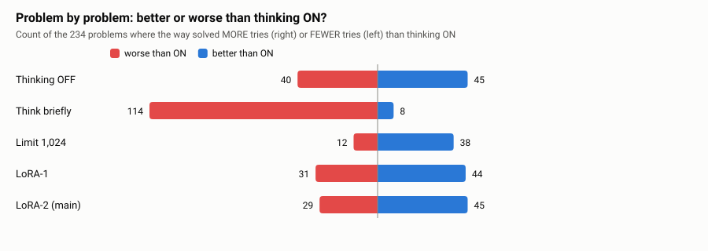
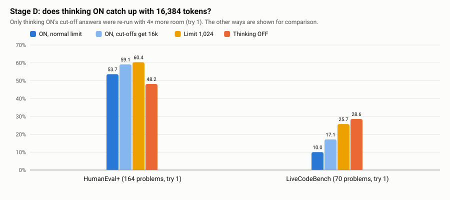
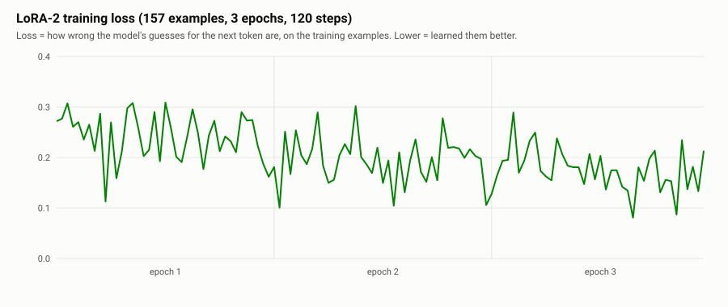
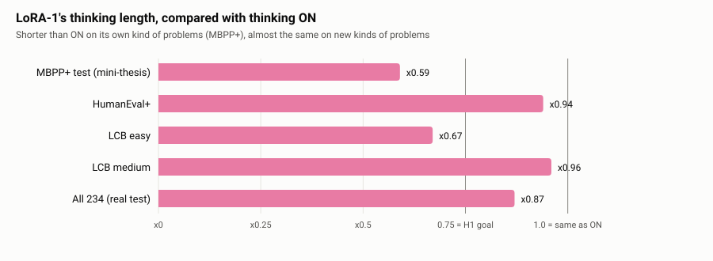
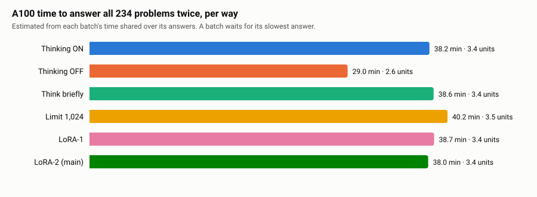

# Stop Overthinking, Keep Passing the Tests

This is the one file for a teacher, and the skeleton of the paper.
Every chart in the study is on this page.
The long chapters are in [FULL-THESIS.md](FULL-THESIS.md).

A *token* is a small piece of text, about three quarters of a word.
A *LoRA* is a small add-on we train. We do not retrain the whole model.

You are in the **CONCLUSION** box.

## Say this first

On small Qwen3.5 code models, a free setting beats training the model to think shorter.
Thinking OFF wins on the 0.8B model.
A 1,024-token thinking limit wins on the 2B model (**49.8%**).
A 2,048-token limit wins on the 4B model (**78.2%**).
The waste is loops: the model repeats itself until it runs out of room.

## 1. Every problem we used

| Pile | How many | What it is |
|---|---|---|
| First exam | **234** | Easy functions plus contest problems. This is the paper's main test. |
| Extra contest | **40** | A later check. Not mixed into 49.8% or 78.2%. |
| More contest | **190** | 118 easy, 72 medium. Not mixed into 49.8% or 78.2%. |
| **Tests in total** | **464** | A count of problems. Not one score. |
| LoRA-1 pool | **100** | Easy functions. Kept 37 on 0.8B and 73 on 4B. The 2B file used this pool. |
| LoRA-2 pool | **280** | 200 easy functions + 80 older contest problems. |
| LoRA-2 kept | **157** | Short correct answers actually used. 133 + 24. |

## 2. The main result (first exam, 234 problems)

2B model. Two tries. 468 answers per way.
Only the limit's gain over normal thinking is proven.
The error bar is **+7.7 points [+4.3, +11.3]**. It does not include 0.

| Way | Passed | Accuracy | Versus normal thinking |
|---|---|---|---|
| Limit 1,024 | 233 / 468 | **49.8%** | **+7.7 [+4.3, +11.3]** |
| LoRA-1 (pool of 100) | 213 / 468 | 45.5% | +3.4 [−0.4, +7.7] |
| LoRA-2 (pool of 280) | 211 / 468 | 45.1% | +3.0 [−1.1, +7.3] |
| Thinking ON | 197 / 468 | 42.1% | — |
| Thinking OFF | 191 / 468 | 40.8% | −1.3 [−6.6, +4.3] |
| Think briefly | 31 / 468 | 6.6% | −35.5 [−41.2, −29.3] |

| Way | All tokens (average) |
|---|---|
| Thinking ON | 3,446 |
| LoRA-2 | 3,392 |
| LoRA-1 | 3,158 |
| Limit 1,024 | 2,722 |
| Thinking OFF | 860 |

Three sizes, same 234 problems. A free way wins on each size.

| Size | Best free way | Score | Trained add-on |
|---|---|---|---|
| 0.8B (1 try) | Thinking OFF | **20.5%** | LoRA-1 17.9% |
| 2B (2 tries) | Limit 1,024 | **49.8%** | LoRA-1 45.5% · LoRA-2 45.1% |
| 4B (2 tries) | Limit 2,048 | **78.2%** | LoRA-1 69.9% |

The best free cap grows with size: OFF, then about 1,024, then about 2,048.
On 2B the curve is 45.1% (limit 512) → **49.8%** (1,024) → 46.6% (2,048, one try). It peaks at 1,024.

## 3. Why the limit wins

Most very long answers were loops.
The model repeated the same lines until the token room ran out.
A limit cuts the loop and forces an answer.
Training on short finished answers does not teach the model how to get unstuck.

Open thinking hits the wall less often as the model grows: **78%** of 0.8B answers, about **41%** of 2B, **28%** of 4B.

Giving normal thinking a huge room (16,384 tokens) on easy functions moved a cut-off retry from 53.7% to 59.1%.
The 1,024 limit was still 60.4%, with much less room.

## 4. What we trained on

LoRA-2's loss fell from about 0.25 to about 0.16, so the add-on did learn the examples.
Thinking length on the exam was still about the same as normal thinking (x1.00).

On 100 easy problems that look like the homework, LoRA-1 scored **65%** against thinking ON at **50%**, with **41%** fewer tokens.
That win did not travel cleanly to the exam.

## 5. Later check: 40 contest problems

Not mixed into the 234. The run took **3.7 hours**.

| Way | 0.8B (1 try) | 2B | 4B (2 tries) |
|---|---|---|---|
| Thinking OFF | **5.0%** (2/40) | **12.5%** (10/80) | **46.2%** (37/80) |
| Thinking ON | 0% | 0% | 18.8% (15/80) |
| Limit 1,024 | 0% | 8.8% (7/80) | not run |
| Limit 2,048 | — | 7.5% (3/40, 1 try) | **46.2%** (37/80) |
| LoRA-1 | 0% | not run | not run |

A free way still wins. On 4B, OFF ties the 2,048 limit.
2B and 4B training were not in that zip.

## 6. Later check: 190 contest problems

Not mixed into the 234. One try. Seed 3407.
The first pass took 7.9 hours. The 2B add-on added 0.5 hours. The hours file says **8.5 hours**.

| Way | 0.8B | 2B | 4B |
|---|---|---|---|
| Thinking OFF | **9.5%** (18/190) | 24.7% (47/190) | 66.8% (127/190) |
| Thinking ON | 1.1% (2/190) | 13.7% (26/190) | 38.9% (74/190) |
| Best limit | 4.2% at 512 | **31.1%** at 1,024 (59/190) | **69.5%** at 2,048 (132/190) |
| LoRA-1 | 7.9% (15/190) | **27.4%** (52/190) | 46.3% (88/190) |

A free way still wins on every size.
The winner matches the first exam: OFF, then limit 1,024, then limit 2,048.

2B LoRA-1 beats OFF (52 vs 47) and ON (52 vs 26).
It loses to the limit (52 vs 59). That gap is 7 answers. We did not draw error bars here.

| 2B on the 190 | Easy (118) | Medium (72) |
|---|---|---|
| Limit 1,024 | **44.1%** (52) | **9.7%** (7) |
| LoRA-1 | 42.4% (50) | 2.8% (2) |
| Thinking OFF | 38.1% (45) | 2.8% (2) |
| Thinking ON | 19.5% (23) | 4.2% (3) |

On 4B medium only, OFF is 44.4% (32/72) and the limit is 38.9% (28/72).
The limit still wins all 190, because easy is 88.1% against OFF at 80.5%.

## 7. What the paper should say

1. The question: is training a small code model to think shorter better than the free settings?
2. The answer on the main test: **no**. On 2B, stop thinking at 1,024 tokens.
3. The reason: the long answers are loops, not careful work.
4. The size rule: OFF on a tiny model, about 1,024 on 2B, about 2,048 on 4B.
5. The later lists agree that a free way still wins. They do not replace 49.8% or 78.2%.

## 8. What the paper must not say

- Do not say 464 problems have one accuracy.
- Do not say the 2B add-on was skipped. It scored 27.4% on the 190.
- Do not say the 7-answer gap on the 190 is proven. Only the +7.7 points on the 234 is proven.
- Do not say a local model was tested for security. It can stay on your machine. That is a setup, not a measured security result.
- Do not say we tested hard problems or a giant model. We stopped at 4B.
