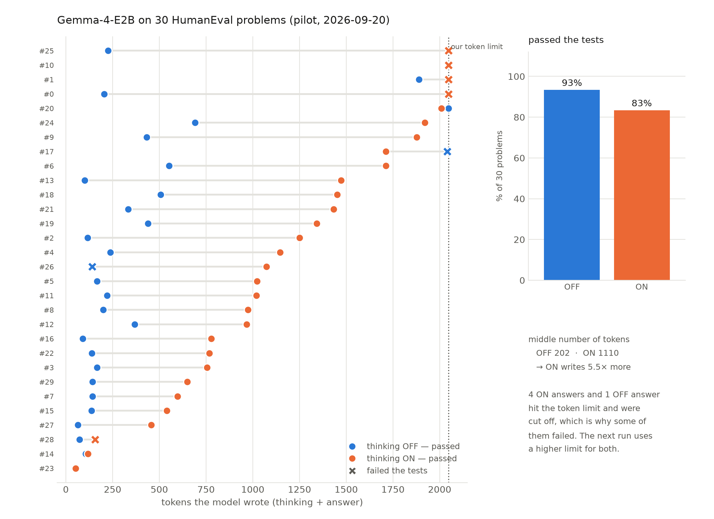

# Result: first real pilot — Gemma-4-E2B on 30 HumanEval problems (2026-09-20)

> **In one sentence:** the small model solves these problems easily (93% with thinking OFF).
> Thinking ON used **5.5× more tokens** and scored **lower**, but mostly because our token
> limit cut its answers off.
>
> Research chain: `EXPERIMENT` → the room-to-shorten check (PLAN §7), first real data.

Files: [answers](2026-09-20-pilot-e2b-humanevalplus.jsonl) · [graded CSV](2026-09-20-pilot-e2b-humanevalplus-graded.csv)
Code: [scripts/mac_pilot_generate.py](../scripts/mac_pilot_generate.py) · [scripts/grade_humaneval.py](../scripts/grade_humaneval.py)

---

## 1. What we ran

| Thing | Value |
|---|---|
| Computer | The user's Mac (Apple M2, 8 GB) |
| Model | `unsloth/gemma-4-E2B-it-UD-MLX-4bit` |
| Problems | The first 30 of HumanEval+ |
| Ways of answering | thinking ON, thinking OFF (1 answer each, seed 3407) |
| Token limit | 2,048 new tokens |
| Settings | temperature 1.0, top_p 0.95, top_k 64 (Gemma's own, DECISIONS #39) |
| Time | 17 minutes for 60 answers, 8 questions at a time |
| Grading | HumanEval's own tests, each answer in its own process with a 15-second limit |

## 2. The numbers

| Way of answering | Passed the tests | Median thinking tokens | Median all tokens | Answers cut off |
|---|---|---|---|---|
| thinking OFF | **28/30 (93.3%)** | 0 | 202 | 1 |
| thinking ON | **25/30 (83.3%)** | 802 | 1,110 | 4 |

Looking only at answers that were **not** cut off by the limit:

| Way of answering | Passed |
|---|---|
| thinking OFF | 27/29 (93%) |
| thinking ON | **25/26 (96%)** |

On the same problems: thinking ON solved 2 that OFF failed; OFF solved 5 that ON failed, and 4 of those 5 were cut off.

## 2b. The picture

One line per problem. Blue dot = thinking OFF, orange dot = thinking ON, and the **gap between
them is the waste**. An ✗ means the answer failed the tests. The dotted line is our 2,048-token
limit: every ✗ sitting on it is an answer that was cut off.
Made by [scripts/plot_pilot.py](../scripts/plot_pilot.py) (also saved as `.pdf` for the thesis).

## 3. What this means

1. **✅ The model is strong enough.** PLAN §7 asks for ≥40% solved. We got 93%. So there
   are plenty of correct answers to shorten, and we do **not** need a bigger model or a
   paid GPU for this part.
2. **✅ There is a lot of room to shorten.** Thinking ON writes 5.5× more tokens than OFF
   (1,110 vs. 202 in the middle). That is exactly the waste our thesis attacks.
3. **⚠️ Our token limit was unfair to thinking ON.** 4 of its answers were cut in the
   middle, which made them fail (broken code: `SyntaxError`, `NameError`). Once we ignore
   cut-off answers, ON is slightly **better** than OFF (96% vs 93%).
   **Fix:** raise the limit for every way of answering (4,096 tokens) and report how many
   answers still hit it. A cut-off answer must be a real finding, not an accident of our setup.
4. **⚠️ HumanEval is too easy to show what thinking is for.** With OFF at 93%, there is
   almost no room to be better. Our thesis needs **medium** problems too, or the honest
   conclusion will only be "on easy code, thinking is not needed".

## 4. A tool problem we found and fixed (checked)

evalplus's own grader **does not work on macOS**. It limits a test process's memory the way
Linux does; macOS refuses, and then every test process dies or hangs.
We proved it: the benchmark's **official** solutions scored **0%** with it.

Our grader runs HumanEval's own tests, each in its own process with a time limit.
The same control test gives **30/30 = 100%** for the official solutions, as it must.

Limit to write in the thesis: these are HumanEval's **original** tests. The extra, harder
HumanEval+ tests need evalplus's runner, which we will run on Linux (Colab or Kaggle).

## 5. Checked vs. not checked

| Checked | Not checked yet |
|---|---|
| 93% (OFF) and 83% (ON) on 30 problems, with the benchmark's tests | The other 134 HumanEval problems, and MBPP+ |
| Our grader is correct (official solutions: 30/30) | The harder HumanEval+ tests (need Linux) |
| Thinking ON writes 5.5× more tokens here | What happens with a fair 4,096-token limit |
| 4 ON answers were cut off and failed because of it | Medium-difficulty problems, where thinking should help |
