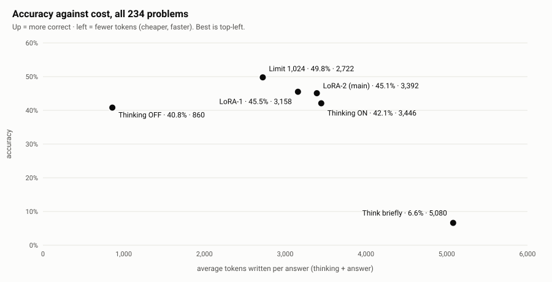
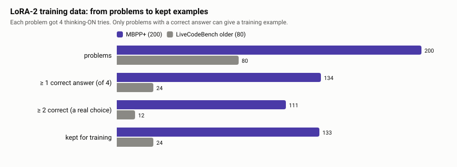
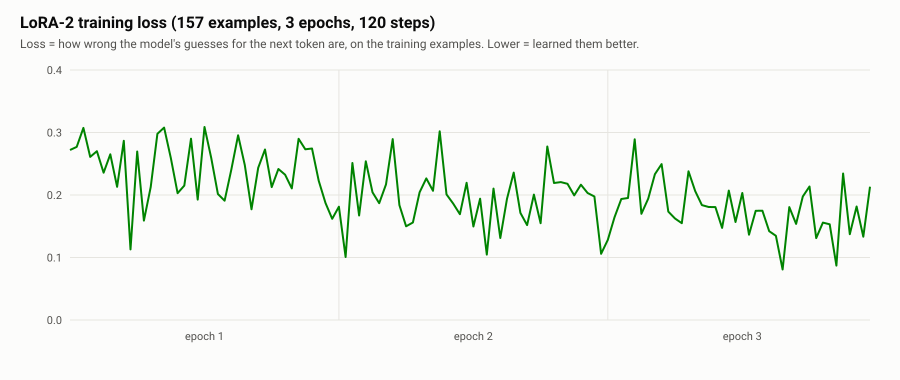
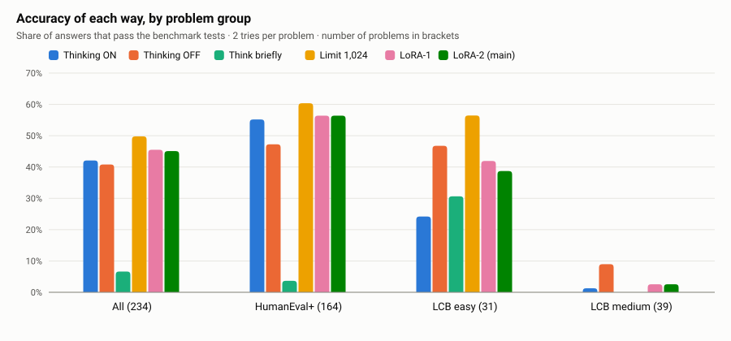
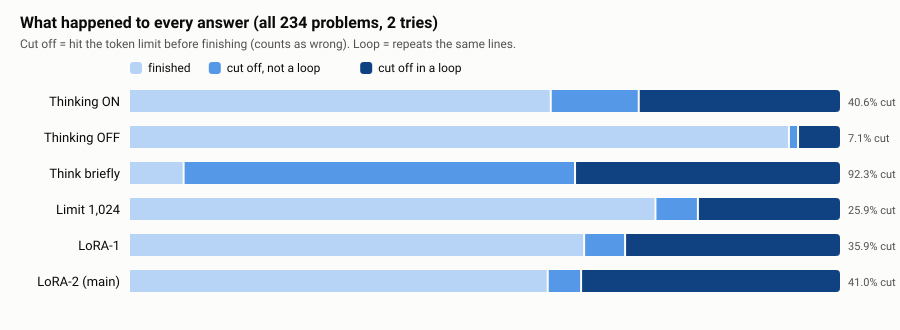
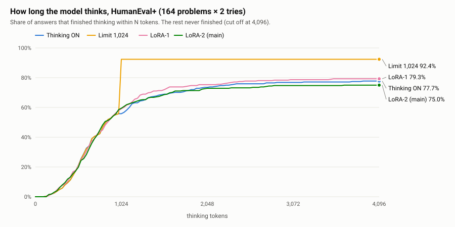
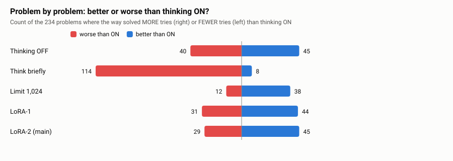
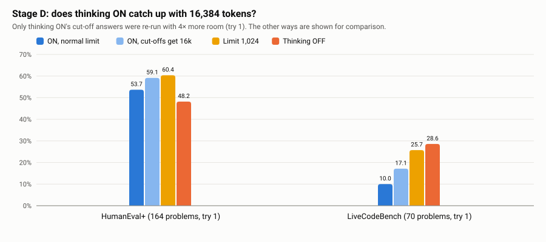
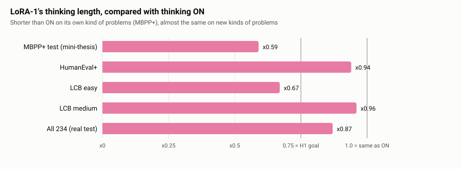
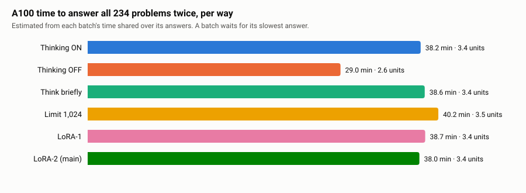

# Full results: the real thesis run (notebook 14)

> **Made by** `node scripts/make_full_results.js` from the raw Drive files in [`results/2026-09-24-thesis-run/`](../2026-09-24-thesis-run/).
> Every number here is computed from those files, not typed by hand. Re-run the script to rebuild this page.
> Short version: [../2026-09-24-thesis-run.md](../2026-09-24-thesis-run.md) · Teacher Q&A: [qa/28](../../qa/28-thesis-run-results.md).

**Where we are:** `PROBLEM ✅ → GAP ✅ → QUESTION ✅ → HYPOTHESIS ✅ → EXPERIMENT ✅ → DATA ✅ → RESULTS ✅ (this page) → ANALYSIS → CONCLUSION`

## Contents

- 0. Words used on this page
- 1. The result in 5 lines
- 2. What we tested (the 9 research questions)
- 3. The set-up: model, GPU, settings
- 4. The test problems (234)
- 5. The training problems (280) and LoRA-2
- 6. Main results: accuracy
- 7. Main results: tokens (cost)
- 8. The hypotheses
- 9. Why: cut-offs and loops
- 10. How long the model thinks
- 11. Problem by problem
- 12. Stage D: was the token limit unfair?
- 13. Why LoRA-2 did not get shorter
- 14. The mini-thesis vs the real test
- 15. Time and money
- 16. Examples from the raw answers
- 17. Honest limits
- 18. Claims for the paper
- Appendix A: every test problem
- Appendix B: every training problem
- Appendix C: files

## 0. Words used on this page

| Word | Meaning |
|---|---|
| token | a small piece of text, about ¾ of a word. The model writes one token at a time. |
| thinking | the text the model writes to itself before the answer. Costs tokens and time. |
| way (of answering) | one set-up we test: thinking ON, OFF, "think briefly", a thinking limit, or ON + a trained LoRA |
| accuracy | the share of answers that pass the benchmark's own tests |
| try | one answer to one problem. Each way answered every problem **2 times** (different random seeds). |
| cut off | the answer hit the token limit before it finished. It has no final code, so it counts as **wrong**. |
| loop | the model repeats the same lines again and again until the limit |
| LoRA | a small add-on trained on top of the model. LoRA-1 = from the mini-thesis, LoRA-2 = trained in this run. |
| error bar [a, b] | the range the true difference probably lies in (95%). If it doesn't include 0, the difference is **proven** for this test. |
| median | the middle value when you sort the numbers. Not pulled up by a few very long answers. |
| unit | Colab's pay unit. An A100 costs about 5.3 units per hour. |

## 1. The result in 5 lines

1. Our trained model (**LoRA-2**) did **not** think shorter: x1.00 of thinking ON's thinking. Accuracy 45.1% vs 42.1% for ON (+3.0 points, not proven).
2. The best way was the free **thinking limit** (stop thinking at 1,024 tokens): **49.8%**, +7.7 points vs ON, proven [4.3, 11.3].
3. **Thinking OFF** reached 40.8%, almost the same as ON, with **860** tokens per answer instead of 3,446 (4× fewer).
4. **Why:** 40.6% of thinking-ON answers were cut off, and most cut-offs were **loops**. Finished answers were already short. Training does not stop loops; a limit does.
5. "Think briefly" failed (6.6%) because the instruction clashed with our "one code block only" rule, and the model argued with itself until the limit.



## 2. What we tested (the 9 research questions)

| Question | Answer |
|---|---|
| What am I testing? | Can training a small model on its own shortest correct answers make it think shorter on code problems, and is that better than free options? |
| Hypothesis | H1: ≥ 25% less thinking than ON · H2: accuracy ≥ ON − 3 points · H3: more accurate than OFF, the limit and "think briefly" |
| Independent variable (what we change) | the way of answering: ON · OFF · think briefly · limit 1,024 · LoRA-1 · LoRA-2 |
| Dependent variables (what we measure) | accuracy · thinking tokens · all tokens · cut-offs · GPU time |
| What we compare against | thinking ON (the model's normal way) |
| Data | 234 test problems: HumanEval+ (164) + LiveCodeBench easy (31) + medium (39) |
| Metric | share of answers passing the benchmark's own tests; paired error bars (same problems, before vs after) |
| What supports it | LoRA-2: thinking ratio ≤ 0.75 AND accuracy ≥ ON − 3 AND better than every free way |
| What contradicts it | thinking not shorter, or a free way (OFF / limit / brief) as good or better |

## 3. The set-up: model, GPU, settings

| Setting | Value | Why |
|---|---|---|
| Model | `unsloth/Qwen3.5-2B` (2 billion parameters, has a thinking ON/OFF switch) | small enough for one GPU; DECISIONS #52–53 |
| GPU | Google Colab **A100** (40 GB), bfloat16, batch 128 | paid units, DECISIONS #48, #63 |
| Sampling | temperature 0.6, top-p 0.95, top-k 20; a fixed seed per try (try 1 seed 3407) | Qwen's own settings; fixed seeds (CLAUDE.md §4) |
| Token limit | **4,096** for HumanEval+, **8,192** for LiveCodeBench, the same for every way | fairness, DECISIONS #66 |
| Limit way | thinking cut at **1,024** tokens, then the model must answer | about LoRA-1's thinking length in the mini-thesis |
| Think briefly | the question + "Think briefly: keep your thinking to a few short sentences, then give the answer." | the simplest prompt-only option |
| Tries | **2** per problem per way | budget, DECISIONS #65 |
| Grading | HumanEval+ plus-tests (evalplus) and LiveCodeBench's own tests, in a separate process with timeouts | never by eye (CLAUDE.md §4) |
| Error bars | paired bootstrap over problems, 2,000 resamples, seed 3407 | `scripts/compare_thesis.py` |
| LoRA training | r 16, alpha 16, lr 2e-4, 3 epochs, batch 1 × 4, adamw_8bit, seed 3407 | `scripts/train_lora.py`, Unsloth's Qwen3.5 guide |
| Main LoRA | **LoRA-2**, named before the run | no picking after results, DECISIONS #66 |

## 4. The test problems (234)

```text
234 test problems
 ├─ HumanEval+     164   all easy · write one Python function · HumanEval/0 … HumanEval/163
 └─ LiveCodeBench   70   read input, print output · released from Feb 2025 on (after the model's data)
      ├─ easy       31
      └─ medium     39   (hard problems left out: a 2B model solves almost none, PLAN §3)
```

The test set was fixed on 2026-09-20, before any result (DECISIONS #58). None of these problems was used for training (overlap check, DECISIONS #66).
Every test problem, with what each way solved, is in **Appendix A** and in [tables/per-problem.csv](tables/per-problem.csv).

**How many problems each way solved at least once (of 2 tries):**

| Way | All (234) | HumanEval+ (164) | LCB easy (31) | LCB medium (39) | only this way solved it |
|---|---|---|---|---|---|
| Thinking ON | 122 | 111 | 10 | 1 | 2 |
| Thinking OFF | 117 | 93 | 18 | 6 | 5 |
| Think briefly | 25 | 11 | 14 | 0 | 0 |
| Limit 1,024 | 136 | 115 | 21 | 0 | 6 |
| LoRA-1 | 131 | 114 | 15 | 2 | 6 |
| LoRA-2 (main) | 127 | 110 | 15 | 2 | 1 |

- Solved by **at least one** way: **168 of 234** problems. Solved by **no** way: **66**.

## 5. The training problems (280) and LoRA-2

LoRA-2 learns from the model's own answers: 4 thinking-ON tries per problem, keep the **shortest correct** one, train on those.

```text
MBPP+ 200 problems (easy functions)          ─┐
LiveCodeBench 80 older problems (before 2025) ─┤→ 4 tries each → grade → shortest correct → 157 examples → LoRA-2
   40 easy + 40 medium                         ─┘
```



|  | MBPP+ | LiveCodeBench (older) |
|---|---|---|
| problems | 200 | 80 (40 easy, 40 medium) |
| answers (4 tries each) | 800 | 320 |
| correct answers | 357 (44.6%) | 44 (13.8%): easy 43/160, **medium 1/160** |
| problems with ≥ 1 correct | 134 | 24 |
| problems with ≥ 2 correct (a real choice of "shortest") | 111 | 12 |
| kept as training examples | 133 | 24 |
| median thinking of kept examples | 515 | **4,709** |
| TARGET (kept length ÷ average correct length; lower = more to learn) | 0.829 | **0.987** (almost nothing to learn) |

Problems with a correct answer that were **not** kept (removed by the overlap check): `Mbpp/309`.
LoRA-2 trained on **157** examples for 3 epochs (120 steps). The mini-thesis answers for MBPP+ were reused, so they were not paid twice.
Every training problem is in **Appendix B** and [tables/training-problems.csv](tables/training-problems.csv).



The loss goes from about 0.25 (first 10 steps) to 0.16 (last 10 steps). So LoRA-2 did learn its examples. The problem is **what** the examples teach (section 13).

## 6. Main results: accuracy



### All — 234 problems, 468 answers per way

| Way | Passed | Accuracy | vs ON, points [95% error bar] |
|---|---|---|---|
| Thinking ON | 197 / 468 | **42.1%** | — |
| Thinking OFF | 191 / 468 | **40.8%** | -1.3 [-6.6, 4.3] |
| Think briefly | 31 / 468 | **6.6%** | -35.5 [-41.2, -29.3] |
| Limit 1,024 | 233 / 468 | **49.8%** | +7.7 [4.3, 11.3] |
| LoRA-1 | 213 / 468 | **45.5%** | +3.4 [-0.4, 7.7] |
| LoRA-2 (main) | 211 / 468 | **45.1%** | +3.0 [-1.1, 7.3] |

### HumanEval+ — 164 problems, 328 answers per way

| Way | Passed | Accuracy | vs ON, points [95% error bar] |
|---|---|---|---|
| Thinking ON | 181 / 328 | **55.2%** | — |
| Thinking OFF | 155 / 328 | **47.3%** | -7.9 [-14.6, -1.2] |
| Think briefly | 12 / 328 | **3.7%** | -51.5 [-57.9, -44.8] |
| Limit 1,024 | 198 / 328 | **60.4%** | +5.2 [1.2, 9.1] |
| LoRA-1 | 185 / 328 | **56.4%** | +1.2 [-3.7, 6.4] |
| LoRA-2 (main) | 185 / 328 | **56.4%** | +1.2 [-4.3, 6.7] |

### LCB easy — 31 problems, 62 answers per way

| Way | Passed | Accuracy | vs ON, points [95% error bar] |
|---|---|---|---|
| Thinking ON | 15 / 62 | **24.2%** | — |
| Thinking OFF | 29 / 62 | **46.8%** | +22.6 [8.1, 37.1] |
| Think briefly | 19 / 62 | **30.6%** | +6.5 [-6.5, 19.4] |
| Limit 1,024 | 35 / 62 | **56.5%** | +32.3 [17.7, 46.8] |
| LoRA-1 | 26 / 62 | **41.9%** | +17.7 [3.2, 32.3] |
| LoRA-2 (main) | 24 / 62 | **38.7%** | +14.5 [3.2, 29.0] |

### LCB medium — 39 problems, 78 answers per way

| Way | Passed | Accuracy | vs ON, points [95% error bar] |
|---|---|---|---|
| Thinking ON | 1 / 78 | **1.3%** | — |
| Thinking OFF | 7 / 78 | **9.0%** | +7.7 [1.3, 15.4] |
| Think briefly | 0 / 78 | **0.0%** | -1.3 [-3.8, 0] |
| Limit 1,024 | 0 / 78 | **0.0%** | -1.3 [-3.8, 0] |
| LoRA-1 | 2 / 78 | **2.6%** | +1.3 [-2.6, 5.1] |
| LoRA-2 (main) | 2 / 78 | **2.6%** | +1.3 [-2.6, 5.1] |

## 7. Main results: tokens (cost)

Averages are pulled up by cut-off answers, so the **median** (middle) is also shown. "Finished" = answers that were not cut off.

### All

| Way | Thinking (avg) | Thinking (median) | Thinking of finished answers (median) | Answer part (avg) | All tokens (avg) | Thinking vs ON [95%] |
|---|---|---|---|---|---|---|
| Thinking ON | 3,262 | 1,434 | 751 (n=278) | 185 | **3,446** | — |
| Thinking OFF | 0 | 0 | 0 (n=435) | 860 | **860** | x0.00 [0.00, 0.00] |
| Think briefly | 5,064 | 4,096 | 3,547 (n=36) | 16 | **5,080** | x1.55 [1.43, 1.70] |
| Limit 1,024 | 843 | 1,024 | 880 (n=347) | 1,879 | **2,722** | x0.26 [0.23, 0.29] |
| LoRA-1 | 2,838 | 1,096 | 740 (n=300) | 320 | **3,158** | x0.87 [0.81, 0.93] |
| LoRA-2 (main) | 3,252 | 1,476 | 719 (n=276) | 140 | **3,392** | x1.00 [0.94, 1.06] |

### HumanEval+

| Way | Thinking (avg) | Thinking (median) | Thinking of finished answers (median) | Answer part (avg) | All tokens (avg) | Thinking vs ON [95%] |
|---|---|---|---|---|---|---|
| Thinking ON | 1,564 | 834 | 672 (n=255) | 181 | **1,745** | — |
| Thinking OFF | 0 | 0 | 0 (n=327) | 256 | **256** | x0.00 [0.00, 0.00] |
| Think briefly | 4,030 | 4,096 | 2,833 (n=15) | 7 | **4,038** | x2.58 [2.30, 2.91] |
| Limit 1,024 | 771 | 834 | 800 (n=303) | 470 | **1,241** | x0.49 [0.45, 0.54] |
| LoRA-1 | 1,469 | 852 | 711 (n=260) | 226 | **1,694** | x0.94 [0.84, 1.05] |
| LoRA-2 (main) | 1,606 | 829 | 695 (n=246) | 181 | **1,788** | x1.03 [0.92, 1.15] |

### LCB easy

| Way | Thinking (avg) | Thinking (median) | Thinking of finished answers (median) | Answer part (avg) | All tokens (avg) | Thinking vs ON [95%] |
|---|---|---|---|---|---|---|
| Thinking ON | 6,950 | 8,192 | 5,130 (n=17) | 167 | **7,117** | — |
| Thinking OFF | 0 | 0 | 0 (n=60) | 547 | **547** | x0.00 [0.00, 0.00] |
| Think briefly | 6,610 | 8,192 | 3,732 (n=20) | 80 | **6,691** | x0.95 [0.84, 1.08] |
| Limit 1,024 | 1,005 | 1,024 | 1,024 (n=40) | 3,120 | **4,124** | x0.14 [0.13, 0.16] |
| LoRA-1 | 4,658 | 5,123 | 1,066 (n=32) | 660 | **5,318** | x0.67 [0.55, 0.79] |
| LoRA-2 (main) | 6,107 | 8,192 | 4,270 (n=27) | 82 | **6,189** | x0.88 [0.76, 0.98] |

### LCB medium

| Way | Thinking (avg) | Thinking (median) | Thinking of finished answers (median) | Answer part (avg) | All tokens (avg) | Thinking vs ON [95%] |
|---|---|---|---|---|---|---|
| Thinking ON | 7,466 | 8,192 | 1,012 (n=6) | 216 | **7,682** | — |
| Thinking OFF | 0 | 0 | 0 (n=48) | 3,648 | **3,648** | x0.00 [0.00, 0.00] |
| Think briefly | 8,179 | 8,192 | 7,217 (n=1) | 2 | **8,182** | x1.10 [1.02, 1.20] |
| Limit 1,024 | 1,017 | 1,024 | 1,024 (n=4) | 6,819 | **7,836** | x0.14 [0.13, 0.15] |
| LoRA-1 | 7,153 | 8,192 | 1,120 (n=8) | 444 | **7,597** | x0.96 [0.87, 1.05] |
| LoRA-2 (main) | 7,903 | 8,192 | 708 (n=3) | 11 | **7,914** | x1.06 [0.98, 1.16] |

**Watch out:** the limit's thinking is short (x0.26), but after the forced stop it keeps writing in the answer part (1,879 tokens on average). Counting **all** tokens, the limit uses 2,722 vs 3,446 for ON: **21.0% fewer**, not 74% fewer.

## 8. The hypotheses (for LoRA-2, fixed in advance)

|  | Test | Needed | Result | Verdict |
|---|---|---|---|---|
| H1 | thinking vs ON | ≤ x0.75 | x1.00 [0.94, 1.06] | ❌ **NO** |
| H2 | accuracy vs ON | ≥ −3 points | +3.0 [-1.1, 7.3] | ✅ YES |
| H3 | vs thinking OFF | > 0 | +4.3 [−0.6, +9.2] | ⚠️ not proven (error bar includes 0) |
| H3 | vs limit 1,024 | > 0 | −4.7 [−9.0, −0.2] | ❌ **NO**: the limit is better (proven) |
| H3 | vs think briefly | > 0 | +38.5 [+32.9, +44.2] | ✅ yes, but brief failed for its own reason (section 16) |

(The H3 numbers are LoRA-2 minus the other way, printed by the notebook; see [the step 12 output](../2026-09-24-thesis-run-step12-output.txt).)

**The answer to the research question: no.** On this model, training was not better than the free options. A free thinking limit was better.

## 9. Why: cut-offs and loops



| Way | Answers | Finished | Cut off | Cut off in a loop | Loops among cut-offs |
|---|---|---|---|---|---|
| Thinking ON | 468 | 278 | 190 (40.6%) | 132 | 69.5% |
| Thinking OFF | 468 | 435 | 33 (7.1%) | 27 | 81.8% |
| Think briefly | 468 | 36 | 432 (92.3%) | 174 | 40.3% |
| Limit 1,024 | 468 | 347 | 121 (25.9%) | 93 | 76.9% |
| LoRA-1 | 468 | 300 | 168 (35.9%) | 141 | 83.9% |
| LoRA-2 (main) | 468 | 276 | 192 (41.0%) | 170 | 88.5% |

| Way | HumanEval+: cut off / loops | LCB easy: cut off / loops | LCB medium: cut off / loops |
|---|---|---|---|
| Thinking ON | 73/328 · 48 | 45/62 · 27 | 72/78 · 57 |
| Thinking OFF | 1/328 · 1 | 2/62 · 2 | 30/78 · 24 |
| Think briefly | 313/328 · 91 | 42/62 · 32 | 77/78 · 51 |
| Limit 1,024 | 25/328 · 18 | 22/62 · 17 | 74/78 · 58 |
| LoRA-1 | 68/328 · 54 | 30/62 · 25 | 70/78 · 62 |
| LoRA-2 (main) | 82/328 · 74 | 35/62 · 30 | 75/78 · 66 |

How the loop test works: a cut-off answer counts as a loop when a piece of its last 200 characters already appears at least twice earlier in the same answer. It misses loops with small changes, so the real numbers are probably **higher**.

## 10. How long the model thinks



On HumanEval+, answers that **finish** think about the same amount with or without training (median of finished answers: ON 672, LoRA-1 711, LoRA-2 695, limit 800). The big difference is how many **never** finish. So the waste is loops, not long careful thinking.

## 11. Problem by problem



| Way | Better than ON (problems) | Worse than ON | Same |
|---|---|---|---|
| Thinking OFF | 45 | 40 | 149 |
| Think briefly | 8 | 114 | 112 |
| Limit 1,024 | 38 | 12 | 184 |
| LoRA-1 | 44 | 31 | 159 |
| LoRA-2 (main) | 45 | 29 | 160 |

"Better" = the way solved more of its 2 tries than ON on that problem.

**Extra paired comparisons** (not printed by the notebook). Same method as the notebook: resample the problems 2,000 times, fixed seed 3407. This JavaScript version gives LoRA-2 − limit = -4.7 [-9.0, -0.2], against the notebook's −4.7 [−9.0, −0.2], so it agrees within rounding noise.

| Comparison | All | HumanEval+ | LCB easy | LCB medium |
|---|---|---|---|---|
| Limit 1,024 − Thinking OFF | +9.0 [+3.8, +14.3] | +13.1 [+6.4, +19.2] | +9.7 [-4.8, +24.2] | -9.0 [-16.7, -2.6] |
| Limit 1,024 − LoRA-2 (main) | +4.7 [+0.2, +9.0] | +4.0 [-1.5, +9.5] | +17.7 [+1.6, +33.9] | -2.6 [-6.4, +0.0] |
| LoRA-2 (main) − LoRA-1 | -0.4 [-4.5, +3.8] | +0.0 [-5.5, +5.2] | -3.2 [-16.1, +9.7] | +0.0 [-3.8, +3.8] |
| Thinking OFF − LoRA-2 (main) | -4.3 [-9.4, +0.9] | -9.1 [-15.5, -2.1] | +8.1 [-3.2, +21.0] | +6.4 [+1.3, +12.8] |

## 12. Stage D: was the token limit unfair to thinking ON?

We re-ran only thinking ON's **cut-off** answers of try 1 with **16,384** tokens (4× more room).



|  | HumanEval+ | LiveCodeBench |
|---|---|---|
| cut-off ON answers re-run | 36 | 60 |
| finished within 16,384 | 23 | 10 |
| correct | 9 | 5 |
| still cut off, in a loop | 12 | 48 |
| ON try 1, normal limit | 88/164 = 53.7% | 7/70 = 10.0% |
| ON try 1, with 16k | **97/164 = 59.1%** | **12/70 = 17.1%** |
| Limit 1,024, try 1 | 99/164 = 60.4% | 18/70 = 25.7% |
| Thinking OFF, try 1 | 79/164 = 48.2% | 20/70 = 28.6% |
| GPU time of the re-run | 18.1 min | 27.9 min |

- **HumanEval+:** with 16k, ON almost catches the limit way. So part of the limit's win on HumanEval+ comes from our 4,096 limit. **The thesis must say this.**
- **LiveCodeBench:** more room helps little; most answers still loop. The limit and OFF stay clearly ahead.

## 13. Why LoRA-2 did not get shorter

1. **Medium training problems gave almost nothing to learn:** the model solved **1 of 160** medium tries, so medium problems gave (almost) no examples.
2. **The LiveCodeBench examples it did get were long:** median **4,709** thinking tokens, and the shortest correct answer was barely shorter than the average correct one (TARGET 0.987). So LoRA-2 learned to think **long** on LiveCodeBench-style problems: on LiveCodeBench answers that finished, its median thinking is 3,974 tokens vs LoRA-1's 1,066.
3. **Training copies short correct answers, but the waste is loops** (section 9). Nothing in the examples teaches "stop when you are going round in circles".

## 14. The mini-thesis vs the real test

In the mini-thesis (100 MBPP+ test problems, 1 try), LoRA-1 cut tokens to **x0.59** and gained **+15 points** (DECISIONS #64). On the real test it did much less:



| Test | LoRA-1 thinking vs ON | LoRA-1 accuracy vs ON |
|---|---|---|
| MBPP+ (mini-thesis, same kind as training) | x0.59 [0.46, 0.75] | +15.0 [+6.0, +25.0] |
| All | x0.87 [0.81, 0.93] | +3.4 [-0.4, 7.7] |
| HumanEval+ | x0.94 [0.84, 1.05] | +1.2 [-3.7, 6.4] |
| LCB easy | x0.67 [0.55, 0.79] | +17.7 [3.2, 32.3] |
| LCB medium | x0.96 [0.87, 1.05] | +1.3 [-2.6, 5.1] |

So the training works on problems **like its training data**, and mostly does **not** carry over to new kinds of problems. This is a finding in itself.

## 15. Time and money



| Way | HumanEval+ (min) | LiveCodeBench (min) | Total (min) | ≈ units |
|---|---|---|---|---|
| Thinking ON | 17.3 | 20.8 | **38.2** | 3.4 |
| Thinking OFF | 8.0 | 21.0 | **29.0** | 2.6 |
| Think briefly | 17.8 | 20.8 | **38.6** | 3.4 |
| Limit 1,024 | 18.2 | 22.0 | **40.2** | 3.5 |
| LoRA-1 | 17.9 | 20.8 | **38.7** | 3.4 |
| LoRA-2 (main) | 17.2 | 20.8 | **38.0** | 3.4 |

- Answering the test set, all ways, 2 tries: **222.6 A100 minutes** (3.7 hours).
- Making LoRA-2's training answers: MBPP+ 43.6 min (partly the mini-thesis's reused answers) + LiveCodeBench 42.6 min. Training LoRA-2 itself: about 6 minutes (ledger 16:52 → 16:58).
- Stage D (16k re-run): 46.0 min.
- **Whole budget:** the ledger went from 69 units (2026-09-21 23:30) to about 30.66 (2026-09-24 20:05): about **38.3 units** used, including set-up and idle time. Colab's own number is the true one.
- Time per answer is estimated: each batch's time shared equally over its answers.
- **Why OFF is not 4× faster here:** answers run in batches of up to 128, and a batch waits for its **slowest** answer. OFF writes 860 tokens on average, but a few of its LiveCodeBench answers ran to 8,192, so its batches still took long. Run one answer at a time (as a user would), time follows tokens. So **tokens are the fair measure of cost**, and GPU minutes here mostly show our batch set-up.

**Ledger (units left, estimated):**

| Time | Event | Units left |
|---|---|---|
| 2026-09-21 23:30 | session start | 69 |
| 2026-09-21 23:46 | smoke test: run | 67.57 |
| 2026-09-21 23:53 | smoke test: done | 66.95 |
| 2026-09-21 23:56 | stage A: run | 66.72 |
| 2026-09-24 14:55 | session start | 58 |
| 2026-09-24 15:03 | stage A: run | 57.33 |
| 2026-09-24 15:35 | stage A: done | 54.46 |
| 2026-09-24 15:36 | B1 training answers: run | 54.41 |
| 2026-09-24 16:52 | B1 training answers: done | 47.71 |
| 2026-09-24 16:52 | B2 train LoRA-2: run | 47.71 |
| 2026-09-24 16:58 | B2 train LoRA-2: done | 47.12 |
| 2026-09-24 16:58 | stage B3: run | 47.12 |
| 2026-09-24 17:18 | stage B3: done | 45.39 |
| 2026-09-24 17:20 | stage C: run | 45.21 |
| 2026-09-24 19:17 | stage C: done | 34.87 |
| 2026-09-24 19:17 | D: 16k re-run: run | 34.82 |
| 2026-09-24 20:05 | D: 16k re-run: done | 30.66 |

## 16. Examples from the raw answers

### A loop (thinking ON, HumanEval/1, try 1, cut off at 4,096 tokens) — the last part:

~~~text
es like empty strings and ensure correct grouping.

The implementation requires careful tracking of parentheses groups, checking for balance, and collecting valid groups into a list.

By iterating through the string, I can identify balanced groups without nested structures, ensuring each group is properly separated and returned.

The key challenge is handling potential edge cases and maintaining the original string's structure while extracting balanced parentheses groups.

I'll track opening and closing parentheses, ensuring each group is properly balanced and separated. The algorithm needs to handle potential edge cases like empty strings and ensure correct grouping.

The implementation requires careful tracking of parentheses groups, checking for balance, and collecting valid groups into a list.

By iterating through the string, I can identify balanced groups without nested structures,
~~~

### "Think briefly" arguing with the rules (HumanEval/0, try 1):

~~~text
de block.
    *   "Answer with one Python code block only" suggests I should not include conversational filler.
    *   "Think briefly... then give the answer." suggests I should include the thinking.
    *   I'll put the thinking first, then the code block.

    *   Wait, I'll check the instruction "Answer with one Python code block only".
    *   This is a strong constraint.
    *   I will output the thinking text, then the code block.
    *   Wait, if I output thinking text, is it "one Python code block only"?
    *   Maybe I should
~~~

Out of 468 "brief" answers, only 36 finished. The prompt already says "Answer with one Python code block only", and "think briefly … then give the answer" adds a second rule. This is a result for **this wording**, not for asking to be brief in general.

## 17. Honest limits

- One model only (Qwen3.5-2B). Bigger models may not loop as much.
- 2 tries per problem and 234 problems: error bars are about ±4–6 points on all problems, and much wider on the small LiveCodeBench groups.
- One wording for "think briefly". Another wording may work better (not tested).
- The token limits (4,096 / 8,192) cut off some honest thinking on HumanEval+ (stage D: +5.5 points for ON).
- LiveCodeBench medium is at the floor (0–9% for every way), so it can't separate the ways.
- The loop test is rough and probably under-counts loops.
- GPU time per way is an estimate from batch times, not a separate measurement per answer.

## 18. Claims for the paper (each with its number)

1. Shortest-correct LoRA training did **not** shorten thinking on the test set (x1.00 [0.94, 1.06]).
2. A thinking limit of 1,024 tokens improved accuracy over thinking ON by **+7.7 points [4.3, 11.3]**, and beat LoRA-2 by 4.7 points [0.2, 9.0].
3. Thinking OFF matched thinking ON (-1.3 points [-6.6, 4.3]) at **860 vs 3,446** tokens per answer.
4. 69.5% of thinking ON's cut-off answers were loops; finished answers were already short (median 672 thinking tokens on HumanEval+).
5. LoRA training shortened thinking on problems like its training data (MBPP+: x0.59) but not on new problem types (HumanEval+ x0.94).
6. A "think briefly" instruction that clashes with an output-format rule made the model think **longer** (x1.55) and fail (6.6%).
7. Giving thinking ON 4× more room (16k) raised HumanEval+ try-1 accuracy from 53.7% to 59.1%, still not above the limit (60.4%).

## Appendix A: every test problem

Each cell = how many of the 2 tries passed. **ON 16k** = the try-1 re-run with 16,384 tokens (only for cut-off answers).

| # | Problem | Set | Level | Thinking ON | Thinking OFF | Think briefly | Limit 1,024 | LoRA-1 | LoRA-2 | ON 16k |
|---|---|---|---|---|---|---|---|---|---|---|
| 1 | `HumanEval/0` | HE+ | easy | 1 | 0 | 0 | **2** | **2** | **2** |  |
| 2 | `HumanEval/1` | HE+ | easy | 0 | 0 | 0 | 0 | 0 | 0 | ✘ |
| 3 | `HumanEval/2` | HE+ | easy | **2** | **2** | 0 | **2** | **2** | **2** |  |
| 4 | `HumanEval/3` | HE+ | easy | **2** | **2** | 0 | **2** | **2** | **2** |  |
| 5 | `HumanEval/4` | HE+ | easy | 1 | **2** | 0 | **2** | **2** | **2** | ✔ |
| 6 | `HumanEval/5` | HE+ | easy | **2** | 0 | 0 | **2** | **2** | **2** |  |
| 7 | `HumanEval/6` | HE+ | easy | 0 | 0 | 0 | 0 | **2** | 0 | ✔ |
| 8 | `HumanEval/7` | HE+ | easy | **2** | **2** | 1 | **2** | **2** | **2** |  |
| 9 | `HumanEval/8` | HE+ | easy | **2** | **2** | 0 | **2** | **2** | **2** |  |
| 10 | `HumanEval/9` | HE+ | easy | 1 | **2** | 0 | 1 | **2** | **2** |  |
| 11 | `HumanEval/10` | HE+ | easy | 0 | 0 | 0 | 0 | 0 | 0 | ✘ |
| 12 | `HumanEval/11` | HE+ | easy | **2** | **2** | 0 | **2** | **2** | **2** |  |
| 13 | `HumanEval/12` | HE+ | easy | **2** | **2** | 0 | **2** | **2** | **2** |  |
| 14 | `HumanEval/13` | HE+ | easy | **2** | 1 | 0 | **2** | **2** | **2** |  |
| 15 | `HumanEval/14` | HE+ | easy | **2** | **2** | 0 | **2** | **2** | **2** |  |
| 16 | `HumanEval/15` | HE+ | easy | **2** | **2** | **2** | **2** | **2** | **2** |  |
| 17 | `HumanEval/16` | HE+ | easy | **2** | **2** | 0 | **2** | **2** | 1 |  |
| 18 | `HumanEval/17` | HE+ | easy | **2** | 0 | 0 | **2** | **2** | 1 |  |
| 19 | `HumanEval/18` | HE+ | easy | **2** | **2** | 0 | **2** | **2** | 1 |  |
| 20 | `HumanEval/19` | HE+ | easy | 1 | 1 | 0 | 1 | 0 | 1 |  |
| 21 | `HumanEval/20` | HE+ | easy | 1 | 0 | 0 | 1 | 0 | 0 |  |
| 22 | `HumanEval/21` | HE+ | easy | **2** | 1 | 0 | **2** | **2** | **2** |  |
| 23 | `HumanEval/22` | HE+ | easy | 0 | 0 | 0 | 0 | 1 | 0 |  |
| 24 | `HumanEval/23` | HE+ | easy | **2** | **2** | 1 | **2** | **2** | **2** |  |
| 25 | `HumanEval/24` | HE+ | easy | 1 | 1 | 0 | **2** | **2** | 1 | ✔ |
| 26 | `HumanEval/25` | HE+ | easy | **2** | **2** | 0 | **2** | **2** | 1 |  |
| 27 | `HumanEval/26` | HE+ | easy | 0 | 0 | 0 | 0 | 0 | 0 |  |
| 28 | `HumanEval/27` | HE+ | easy | 1 | 0 | 0 | 0 | **2** | **2** | ✔ |
| 29 | `HumanEval/28` | HE+ | easy | **2** | **2** | 1 | **2** | **2** | **2** |  |
| 30 | `HumanEval/29` | HE+ | easy | **2** | **2** | 0 | **2** | **2** | **2** |  |
| 31 | `HumanEval/30` | HE+ | easy | **2** | **2** | 0 | **2** | **2** | **2** |  |
| 32 | `HumanEval/31` | HE+ | easy | **2** | **2** | 0 | **2** | **2** | **2** |  |
| 33 | `HumanEval/32` | HE+ | easy | 0 | 0 | 0 | 0 | 0 | 0 | ✘ |
| 34 | `HumanEval/33` | HE+ | easy | 1 | 1 | 0 | 1 | 1 | 0 |  |
| 35 | `HumanEval/34` | HE+ | easy | **2** | **2** | 0 | **2** | **2** | **2** |  |
| 36 | `HumanEval/35` | HE+ | easy | **2** | **2** | 1 | **2** | **2** | **2** |  |
| 37 | `HumanEval/36` | HE+ | easy | 0 | 1 | 0 | **2** | 0 | 1 | ✘ |
| 38 | `HumanEval/37` | HE+ | easy | 0 | 0 | 0 | **2** | 0 | 1 | ✘ |
| 39 | `HumanEval/38` | HE+ | easy | 0 | 0 | 0 | 0 | 0 | 1 | ✘ |
| 40 | `HumanEval/39` | HE+ | easy | 1 | 0 | 0 | 0 | 0 | 0 | ✘ |
| 41 | `HumanEval/40` | HE+ | easy | 0 | 1 | 0 | **2** | 0 | 1 | ✘ |
| 42 | `HumanEval/41` | HE+ | easy | 0 | **2** | 0 | 0 | 1 | 1 |  |
| 43 | `HumanEval/42` | HE+ | easy | **2** | **2** | 1 | **2** | **2** | **2** |  |
| 44 | `HumanEval/43` | HE+ | easy | 1 | **2** | 0 | 1 | 1 | **2** |  |
| 45 | `HumanEval/44` | HE+ | easy | 0 | **2** | 0 | 0 | 0 | 1 |  |
| 46 | `HumanEval/45` | HE+ | easy | **2** | **2** | 0 | **2** | **2** | **2** |  |
| 47 | `HumanEval/46` | HE+ | easy | 1 | **2** | 0 | 1 | 1 | **2** |  |
| 48 | `HumanEval/47` | HE+ | easy | **2** | **2** | 0 | **2** | 1 | **2** |  |
| 49 | `HumanEval/48` | HE+ | easy | **2** | **2** | 0 | **2** | 1 | **2** |  |
| 50 | `HumanEval/49` | HE+ | easy | **2** | **2** | 0 | **2** | **2** | **2** |  |
| 51 | `HumanEval/50` | HE+ | easy | 1 | 1 | 0 | 1 | 1 | **2** |  |
| 52 | `HumanEval/51` | HE+ | easy | **2** | **2** | 0 | **2** | **2** | **2** |  |
| 53 | `HumanEval/52` | HE+ | easy | **2** | **2** | 0 | **2** | **2** | **2** |  |
| 54 | `HumanEval/53` | HE+ | easy | **2** | **2** | 0 | **2** | **2** | **2** |  |
| 55 | `HumanEval/54` | HE+ | easy | 0 | 0 | 0 | 0 | 0 | 0 |  |
| 56 | `HumanEval/55` | HE+ | easy | **2** | **2** | 0 | **2** | **2** | **2** |  |
| 57 | `HumanEval/56` | HE+ | easy | 1 | **2** | 1 | **2** | **2** | **2** |  |
| 58 | `HumanEval/57` | HE+ | easy | 1 | 1 | 0 | 1 | 1 | 1 |  |
| 59 | `HumanEval/58` | HE+ | easy | **2** | **2** | 0 | **2** | **2** | **2** |  |
| 60 | `HumanEval/59` | HE+ | easy | 1 | 1 | 0 | 1 | **2** | 1 |  |
| 61 | `HumanEval/60` | HE+ | easy | **2** | **2** | 1 | **2** | **2** | **2** |  |
| 62 | `HumanEval/61` | HE+ | easy | **2** | **2** | 0 | **2** | **2** | **2** |  |
| 63 | `HumanEval/62` | HE+ | easy | 0 | 1 | 0 | 1 | 0 | 0 | ✘ |
| 64 | `HumanEval/63` | HE+ | easy | **2** | **2** | 0 | **2** | 0 | **2** |  |
| 65 | `HumanEval/64` | HE+ | easy | 0 | 0 | 0 | 0 | 0 | 0 |  |
| 66 | `HumanEval/65` | HE+ | easy | 0 | 1 | 0 | 1 | 0 | 1 | ✘ |
| 67 | `HumanEval/66` | HE+ | easy | **2** | **2** | 0 | **2** | **2** | **2** |  |
| 68 | `HumanEval/67` | HE+ | easy | **2** | 0 | 0 | **2** | 1 | 1 |  |
| 69 | `HumanEval/68` | HE+ | easy | 1 | **2** | 0 | 1 | 1 | 0 |  |
| 70 | `HumanEval/69` | HE+ | easy | **2** | **2** | 0 | **2** | **2** | 1 |  |
| 71 | `HumanEval/70` | HE+ | easy | 0 | 0 | 0 | 0 | 0 | 0 |  |
| 72 | `HumanEval/71` | HE+ | easy | **2** | 0 | 0 | **2** | **2** | **2** |  |
| 73 | `HumanEval/72` | HE+ | easy | **2** | **2** | 0 | **2** | **2** | **2** |  |
| 74 | `HumanEval/73` | HE+ | easy | **2** | 0 | 0 | **2** | **2** | **2** |  |
| 75 | `HumanEval/74` | HE+ | easy | **2** | 0 | 0 | **2** | **2** | **2** |  |
| 76 | `HumanEval/75` | HE+ | easy | 1 | 0 | 0 | 0 | 0 | **2** |  |
| 77 | `HumanEval/76` | HE+ | easy | 0 | 0 | 0 | 0 | 0 | 0 |  |
| 78 | `HumanEval/77` | HE+ | easy | 0 | 0 | 0 | 0 | 0 | 0 | ✘ |
| 79 | `HumanEval/78` | HE+ | easy | 1 | **2** | 0 | **2** | **2** | **2** | ✔ |
| 80 | `HumanEval/79` | HE+ | easy | 1 | **2** | 0 | 1 | **2** | **2** |  |
| 81 | `HumanEval/80` | HE+ | easy | **2** | **2** | 1 | **2** | **2** | **2** |  |
| 82 | `HumanEval/81` | HE+ | easy | 1 | 0 | 0 | 1 | 0 | 0 |  |
| 83 | `HumanEval/82` | HE+ | easy | **2** | **2** | 1 | **2** | **2** | **2** |  |
| 84 | `HumanEval/83` | HE+ | easy | 0 | 0 | 0 | 1 | 0 | 0 | ✘ |
| 85 | `HumanEval/84` | HE+ | easy | 1 | 0 | 0 | 1 | 1 | 1 |  |
| 86 | `HumanEval/85` | HE+ | easy | **2** | 1 | 0 | **2** | **2** | **2** |  |
| 87 | `HumanEval/86` | HE+ | easy | 0 | 0 | 0 | 0 | 0 | 0 | ✘ |
| 88 | `HumanEval/87` | HE+ | easy | 1 | 0 | 0 | **2** | 1 | 1 |  |
| 89 | `HumanEval/88` | HE+ | easy | 1 | **2** | 0 | **2** | 0 | 0 |  |
| 90 | `HumanEval/89` | HE+ | easy | 1 | 1 | 0 | 0 | 1 | 1 |  |
| 91 | `HumanEval/90` | HE+ | easy | 0 | 1 | 0 | 0 | 1 | 1 |  |
| 92 | `HumanEval/91` | HE+ | easy | 0 | 0 | 0 | 0 | 0 | 0 | ✘ |
| 93 | `HumanEval/92` | HE+ | easy | **2** | **2** | 0 | **2** | 1 | **2** |  |
| 94 | `HumanEval/93` | HE+ | easy | 0 | 0 | 0 | 0 | 0 | 0 |  |
| 95 | `HumanEval/94` | HE+ | easy | 1 | 1 | 0 | **2** | 1 | **2** | ✔ |
| 96 | `HumanEval/95` | HE+ | easy | 1 | **2** | 0 | 1 | **2** | 0 |  |
| 97 | `HumanEval/96` | HE+ | easy | 0 | **2** | 0 | 0 | 1 | 1 |  |
| 98 | `HumanEval/97` | HE+ | easy | 0 | 0 | 0 | 0 | 1 | 0 |  |
| 99 | `HumanEval/98` | HE+ | easy | **2** | **2** | 0 | **2** | 1 | 1 |  |
| 100 | `HumanEval/99` | HE+ | easy | 0 | 1 | 0 | 0 | **2** | 0 | ✔ |
| 101 | `HumanEval/100` | HE+ | easy | **2** | 0 | 0 | **2** | 1 | 0 | ✘ |
| 102 | `HumanEval/101` | HE+ | easy | 0 | 0 | 0 | 1 | 0 | 1 |  |
| 103 | `HumanEval/102` | HE+ | easy | **2** | 1 | 0 | **2** | **2** | **2** |  |
| 104 | `HumanEval/103` | HE+ | easy | 0 | 0 | 0 | 0 | 1 | 0 |  |
| 105 | `HumanEval/104` | HE+ | easy | 1 | 1 | 0 | **2** | **2** | **2** |  |
| 106 | `HumanEval/105` | HE+ | easy | **2** | **2** | 0 | **2** | **2** | **2** |  |
| 107 | `HumanEval/106` | HE+ | easy | 1 | 0 | 0 | 1 | 1 | **2** |  |
| 108 | `HumanEval/107` | HE+ | easy | 1 | 0 | 0 | 0 | 1 | 1 |  |
| 109 | `HumanEval/108` | HE+ | easy | 0 | 0 | 0 | 0 | 0 | 0 |  |
| 110 | `HumanEval/109` | HE+ | easy | **2** | 1 | 0 | 1 | 1 | 0 |  |
| 111 | `HumanEval/110` | HE+ | easy | **2** | 1 | 0 | 1 | 1 | 0 |  |
| 112 | `HumanEval/111` | HE+ | easy | 1 | **2** | 0 | 1 | 0 | **2** |  |
| 113 | `HumanEval/112` | HE+ | easy | 1 | 1 | 0 | 1 | 0 | 1 |  |
| 114 | `HumanEval/113` | HE+ | easy | 0 | 0 | 0 | 0 | 1 | 0 |  |
| 115 | `HumanEval/114` | HE+ | easy | 0 | 0 | 0 | 0 | 1 | 1 |  |
| 116 | `HumanEval/115` | HE+ | easy | 0 | 0 | 0 | 0 | 1 | 1 |  |
| 117 | `HumanEval/116` | HE+ | easy | 1 | **2** | 0 | **2** | 0 | 0 |  |
| 118 | `HumanEval/117` | HE+ | easy | **2** | 0 | 0 | **2** | 0 | 0 |  |
| 119 | `HumanEval/118` | HE+ | easy | 0 | 0 | 0 | 0 | 0 | 0 | ✘ |
| 120 | `HumanEval/119` | HE+ | easy | 1 | 1 | 0 | 1 | 1 | 1 | ✘ |
| 121 | `HumanEval/120` | HE+ | easy | 0 | 1 | 0 | **2** | 1 | 1 | ✘ |
| 122 | `HumanEval/121` | HE+ | easy | **2** | 1 | 1 | **2** | 1 | **2** |  |
| 123 | `HumanEval/122` | HE+ | easy | 0 | 0 | 0 | 0 | 0 | 0 |  |
| 124 | `HumanEval/123` | HE+ | easy | **2** | 0 | 0 | **2** | 1 | 0 |  |
| 125 | `HumanEval/124` | HE+ | easy | 0 | 0 | 0 | 0 | 0 | 0 |  |
| 126 | `HumanEval/125` | HE+ | easy | 0 | 0 | 0 | 0 | 0 | 0 |  |
| 127 | `HumanEval/126` | HE+ | easy | 0 | 1 | 0 | 0 | 0 | 0 | ✔ |
| 128 | `HumanEval/127` | HE+ | easy | **2** | 0 | 0 | **2** | 1 | **2** |  |
| 129 | `HumanEval/128` | HE+ | easy | **2** | 0 | 0 | 1 | 1 | **2** |  |
| 130 | `HumanEval/129` | HE+ | easy | 0 | 0 | 0 | 0 | 0 | 0 | ✘ |
| 131 | `HumanEval/130` | HE+ | easy | 0 | 0 | 0 | 0 | 0 | 0 |  |
| 132 | `HumanEval/131` | HE+ | easy | 0 | 0 | 0 | 0 | 0 | 0 |  |
| 133 | `HumanEval/132` | HE+ | easy | 0 | 0 | 0 | 0 | 0 | 0 | ✘ |
| 134 | `HumanEval/133` | HE+ | easy | **2** | 0 | 0 | **2** | **2** | **2** |  |
| 135 | `HumanEval/134` | HE+ | easy | 0 | 0 | 0 | 0 | 0 | 0 | ✘ |
| 136 | `HumanEval/135` | HE+ | easy | 1 | 1 | 0 | 1 | 1 | 0 |  |
| 137 | `HumanEval/136` | HE+ | easy | 1 | 0 | 0 | 1 | **2** | **2** |  |
| 138 | `HumanEval/137` | HE+ | easy | 0 | 0 | 0 | 0 | **2** | 1 | ✘ |
| 139 | `HumanEval/138` | HE+ | easy | **2** | 0 | 0 | **2** | **2** | **2** |  |
| 140 | `HumanEval/139` | HE+ | easy | **2** | 0 | 0 | **2** | **2** | **2** |  |
| 141 | `HumanEval/140` | HE+ | easy | 0 | 0 | 0 | 0 | 0 | 0 |  |
| 142 | `HumanEval/141` | HE+ | easy | **2** | 0 | 0 | 1 | 1 | 1 |  |
| 143 | `HumanEval/142` | HE+ | easy | **2** | 0 | 0 | **2** | 1 | **2** |  |
| 144 | `HumanEval/143` | HE+ | easy | **2** | 0 | 0 | **2** | **2** | **2** |  |
| 145 | `HumanEval/144` | HE+ | easy | 1 | 1 | 0 | **2** | **2** | **2** |  |
| 146 | `HumanEval/145` | HE+ | easy | 0 | 0 | 0 | 0 | 0 | 0 |  |
| 147 | `HumanEval/146` | HE+ | easy | **2** | **2** | 0 | **2** | 1 | 1 |  |
| 148 | `HumanEval/147` | HE+ | easy | 0 | 0 | 0 | 0 | 1 | 0 | ✘ |
| 149 | `HumanEval/148` | HE+ | easy | 0 | 1 | 0 | 0 | 1 | **2** |  |
| 150 | `HumanEval/149` | HE+ | easy | 1 | 1 | 0 | **2** | **2** | **2** |  |
| 151 | `HumanEval/150` | HE+ | easy | **2** | **2** | 0 | **2** | **2** | **2** |  |
| 152 | `HumanEval/151` | HE+ | easy | **2** | **2** | 0 | **2** | **2** | **2** |  |
| 153 | `HumanEval/152` | HE+ | easy | **2** | **2** | 0 | **2** | **2** | **2** |  |
| 154 | `HumanEval/153` | HE+ | easy | 1 | **2** | 0 | **2** | **2** | **2** |  |
| 155 | `HumanEval/154` | HE+ | easy | 0 | 0 | 0 | 1 | 0 | 0 | ✘ |
| 156 | `HumanEval/155` | HE+ | easy | **2** | **2** | 0 | **2** | **2** | 1 |  |
| 157 | `HumanEval/156` | HE+ | easy | 0 | 0 | 0 | 0 | 0 | 0 |  |
| 158 | `HumanEval/157` | HE+ | easy | 1 | **2** | 0 | 1 | **2** | 0 | ✔ |
| 159 | `HumanEval/158` | HE+ | easy | 1 | **2** | 0 | 1 | 1 | **2** |  |
| 160 | `HumanEval/159` | HE+ | easy | 1 | 0 | 0 | 0 | 0 | 1 | ✘ |
| 161 | `HumanEval/160` | HE+ | easy | 0 | 0 | 0 | 1 | 0 | 0 | ✘ |
| 162 | `HumanEval/161` | HE+ | easy | **2** | 0 | 0 | **2** | **2** | 0 |  |
| 163 | `HumanEval/162` | HE+ | easy | **2** | 1 | 0 | **2** | 1 | **2** |  |
| 164 | `HumanEval/163` | HE+ | easy | 0 | 0 | 0 | 0 | 0 | 0 | ✘ |
| 165 | `lcb/arc192_a` | LCB | medium | 0 | 0 | 0 | 0 | 0 | 0 | ✘ |
| 166 | `lcb/arc194_a` | LCB | medium | 0 | 0 | 0 | 0 | 0 | 0 | ✘ |
| 167 | `lcb/arc195_a` | LCB | medium | 0 | 0 | 0 | 0 | 0 | 0 | ✘ |
| 168 | `lcb/abc391_a` | LCB | easy | **2** | **2** | 0 | **2** | 1 | **2** |  |
| 169 | `lcb/abc391_b` | LCB | easy | 0 | 0 | 0 | 1 | 0 | 0 | ✘ |
| 170 | `lcb/abc391_d` | LCB | medium | 0 | 0 | 0 | 0 | 0 | 0 | ✘ |
| 171 | `lcb/abc392_a` | LCB | easy | 0 | **2** | **2** | **2** | **2** | 0 | ✘ |
| 172 | `lcb/abc392_b` | LCB | easy | 0 | **2** | 1 | 1 | 1 | **2** | ✔ |
| 173 | `lcb/abc392_c` | LCB | medium | 0 | 0 | 0 | 0 | 0 | 0 | ✘ |
| 174 | `lcb/abc392_d` | LCB | medium | 0 | 0 | 0 | 0 | 0 | 0 | ✘ |
| 175 | `lcb/abc393_a` | LCB | easy | 0 | 1 | 1 | **2** | **2** | **2** | ✔ |
| 176 | `lcb/abc393_b` | LCB | easy | 0 | **2** | 0 | 1 | 0 | 0 | ✘ |
| 177 | `lcb/abc394_a` | LCB | easy | **2** | **2** | **2** | **2** | **2** | 1 |  |
| 178 | `lcb/abc394_b` | LCB | easy | 1 | **2** | 1 | **2** | **2** | **2** |  |
| 179 | `lcb/abc394_c` | LCB | medium | 0 | 0 | 0 | 0 | 0 | 0 | ✘ |
| 180 | `lcb/abc394_d` | LCB | medium | 0 | 0 | 0 | 0 | 0 | 0 | ✘ |
| 181 | `lcb/abc395_a` | LCB | easy | 1 | **2** | **2** | **2** | **2** | **2** |  |
| 182 | `lcb/abc395_b` | LCB | easy | 0 | 0 | 0 | 0 | 0 | 0 | ✘ |
| 183 | `lcb/abc395_c` | LCB | medium | 0 | 0 | 0 | 0 | 0 | 0 | ✘ |
| 184 | `lcb/abc396_a` | LCB | easy | **2** | **2** | **2** | **2** | **2** | **2** |  |
| 185 | `lcb/abc396_b` | LCB | easy | 0 | 1 | 0 | 0 | 0 | 0 | ✘ |
| 186 | `lcb/abc396_c` | LCB | medium | 0 | 0 | 0 | 0 | 0 | 0 | ✘ |
| 187 | `lcb/abc396_d` | LCB | medium | 0 | **2** | 0 | 0 | 0 | 0 | ✘ |
| 188 | `lcb/abc397_a` | LCB | easy | **2** | **2** | 1 | **2** | **2** | **2** |  |
| 189 | `lcb/abc397_b` | LCB | medium | 0 | 0 | 0 | 0 | 0 | 0 | ✘ |
| 190 | `lcb/abc397_c` | LCB | medium | 0 | 1 | 0 | 0 | 0 | 0 | ✘ |
| 191 | `lcb/abc398_a` | LCB | easy | 0 | 0 | 0 | 0 | 0 | 0 | ✘ |
| 192 | `lcb/abc398_b` | LCB | medium | 0 | 1 | 0 | 0 | 0 | 1 | ✘ |
| 193 | `lcb/abc398_c` | LCB | medium | 0 | 0 | 0 | 0 | 0 | 0 | ✘ |
| 194 | `lcb/abc399_a` | LCB | easy | 1 | **2** | 1 | 1 | **2** | **2** | ✔ |
| 195 | `lcb/abc399_b` | LCB | easy | 0 | 0 | 0 | 0 | 0 | 0 | ✘ |
| 196 | `lcb/abc399_c` | LCB | medium | 0 | 1 | 0 | 0 | 1 | 0 | ✘ |
| 197 | `lcb/abc399_d` | LCB | medium | 0 | 0 | 0 | 0 | 0 | 0 | ✘ |
| 198 | `lcb/abc400_a` | LCB | easy | 1 | 1 | **2** | **2** | **2** | 1 | ✔ |
| 199 | `lcb/abc400_b` | LCB | easy | 1 | 1 | 0 | **2** | **2** | 1 | ✘ |
| 200 | `lcb/abc400_c` | LCB | medium | 0 | 1 | 0 | 0 | 0 | 0 | ✘ |
| 201 | `lcb/abc400_d` | LCB | medium | 0 | 0 | 0 | 0 | 0 | 0 | ✘ |
| 202 | `lcb/3705` | LCB | easy | 0 | 0 | 0 | 0 | 0 | 0 | ✘ |
| 203 | `lcb/3709` | LCB | easy | 0 | 1 | 0 | **2** | 1 | 1 | ✘ |
| 204 | `lcb/3722` | LCB | medium | 0 | 0 | 0 | 0 | 0 | 0 | ✘ |
| 205 | `lcb/3723` | LCB | easy | 0 | 0 | 0 | 1 | 0 | 0 | ✘ |
| 206 | `lcb/3736` | LCB | easy | 0 | 0 | 1 | **2** | 1 | 0 | ✘ |
| 207 | `lcb/3743` | LCB | medium | 0 | 0 | 0 | 0 | 0 | 0 | ✘ |
| 208 | `lcb/3748` | LCB | medium | 0 | 0 | 0 | 0 | 0 | 0 | ✘ |
| 209 | `lcb/3750` | LCB | medium | 0 | 0 | 0 | 0 | 0 | 0 | ✘ |
| 210 | `lcb/3753` | LCB | easy | 0 | 0 | 0 | **2** | 0 | 0 | ✘ |
| 211 | `lcb/3754` | LCB | medium | 0 | 0 | 0 | 0 | 0 | 0 | ✘ |
| 212 | `lcb/3759` | LCB | medium | 0 | 0 | 0 | 0 | 0 | 0 | ✘ |
| 213 | `lcb/3760` | LCB | medium | 0 | 0 | 0 | 0 | 0 | 0 |  |
| 214 | `lcb/3763` | LCB | medium | 0 | 0 | 0 | 0 | 0 | 0 | ✘ |
| 215 | `lcb/3764` | LCB | medium | 1 | 0 | 0 | 0 | 0 | 0 |  |
| 216 | `lcb/3768` | LCB | easy | 0 | **2** | 0 | 1 | **2** | 1 | ✘ |
| 217 | `lcb/3771` | LCB | medium | 0 | 0 | 0 | 0 | 0 | 0 | ✘ |
| 218 | `lcb/3773` | LCB | easy | 0 | 0 | 0 | 0 | 0 | 0 | ✘ |
| 219 | `lcb/3776` | LCB | medium | 0 | 0 | 0 | 0 | 0 | 0 | ✘ |
| 220 | `lcb/3778` | LCB | easy | 0 | 1 | 1 | 0 | 0 | **2** | ✘ |
| 221 | `lcb/3779` | LCB | medium | 0 | 0 | 0 | 0 | 0 | 0 | ✘ |
| 222 | `lcb/3785` | LCB | medium | 0 | 0 | 0 | 0 | 0 | 0 | ✘ |
| 223 | `lcb/3786` | LCB | medium | 0 | 0 | 0 | 0 | 0 | 0 | ✘ |
| 224 | `lcb/3788` | LCB | easy | 0 | 0 | 0 | 0 | 0 | 0 |  |
| 225 | `lcb/3791` | LCB | medium | 0 | 0 | 0 | 0 | 0 | 0 | ✘ |
| 226 | `lcb/3793` | LCB | medium | 0 | 0 | 0 | 0 | 0 | 0 | ✘ |
| 227 | `lcb/3794` | LCB | medium | 0 | 0 | 0 | 0 | 0 | 0 | ✘ |
| 228 | `lcb/3795` | LCB | medium | 0 | 0 | 0 | 0 | 0 | 0 | ✘ |
| 229 | `lcb/3799` | LCB | easy | 0 | 0 | 0 | 0 | 0 | 0 | ✘ |
| 230 | `lcb/3805` | LCB | medium | 0 | 0 | 0 | 0 | 0 | 0 | ✘ |
| 231 | `lcb/3809` | LCB | medium | 0 | 1 | 0 | 0 | 1 | 1 | ✘ |
| 232 | `lcb/3811` | LCB | easy | **2** | 0 | 1 | 1 | 0 | 1 |  |
| 233 | `lcb/3817` | LCB | easy | 0 | 1 | 1 | **2** | 0 | 0 | ✔ |
| 234 | `lcb/3832` | LCB | easy | 0 | 0 | 0 | 0 | 0 | 0 | ✘ |

## Appendix B: every training problem

Correct = how many of the 4 tries passed. Kept = became a training example (the shortest correct answer).

| # | Problem | Pool | Level | Correct (of 4) | Kept | Kept thinking tokens | Question starts with |
|---|---|---|---|---|---|---|---|
| 1 | `lcb/abc301_d` | LCB old | medium | 0 |  |  |  |
| 2 | `lcb/abc302_c` | LCB old | medium | 0 |  |  |  |
| 3 | `lcb/abc302_d` | LCB old | medium | 0 |  |  |  |
| 4 | `lcb/abc303_c` | LCB old | medium | 0 |  |  |  |
| 5 | `lcb/abc303_d` | LCB old | medium | 0 |  |  |  |
| 6 | `lcb/abc307_a` | LCB old | easy | 2 | ✔ | 4862 | Takahashi has recorded the number of steps he walked for N weeks. He w |
| 7 | `lcb/abc308_a` | LCB old | easy | 1 | ✔ | 7198 | Given eight integers S_1,S_2,\dots, and S_8, print Yes if they satisfy |
| 8 | `lcb/abc308_b` | LCB old | easy | 0 |  |  |  |
| 9 | `lcb/abc309_c` | LCB old | medium | 0 |  |  |  |
| 10 | `lcb/abc309_d` | LCB old | medium | 0 |  |  |  |
| 11 | `lcb/abc311_d` | LCB old | medium | 0 |  |  |  |
| 12 | `lcb/abc312_a` | LCB old | easy | 4 | ✔ | 3516 | Given a length-3 string S consisting of uppercase English letters, pri |
| 13 | `lcb/abc312_b` | LCB old | easy | 0 |  |  |  |
| 14 | `lcb/abc313_a` | LCB old | easy | 1 | ✔ | 6224 | There are N people numbered 1 through N. Each person has a integer sco |
| 15 | `lcb/abc314_a` | LCB old | easy | 1 | ✔ | 7596 | The number pi to the 100-th decimal place is 3.14159265358979323846264 |
| 16 | `lcb/abc314_c` | LCB old | medium | 0 |  |  |  |
| 17 | `lcb/abc315_a` | LCB old | easy | 3 | ✔ | 2233 | You are given a string S consisting of lowercase English letters. Remo |
| 18 | `lcb/abc318_d` | LCB old | medium | 0 |  |  |  |
| 19 | `lcb/abc319_b` | LCB old | easy | 1 | ✔ | 5837 | You are given a positive integer N. Print a string of length (N+1), s_ |
| 20 | `lcb/abc320_a` | LCB old | easy | 2 | ✔ | 5094 | You are given positive integers A and B. Print the value A^B+B^A. Inpu |
| 21 | `lcb/abc321_c` | LCB old | medium | 0 |  |  |  |
| 22 | `lcb/abc322_a` | LCB old | easy | 0 |  |  |  |
| 23 | `lcb/abc322_c` | LCB old | medium | 0 |  |  |  |
| 24 | `lcb/abc325_b` | LCB old | medium | 0 |  |  |  |
| 25 | `lcb/abc326_b` | LCB old | easy | 1 | ✔ | 1962 | A 326-like number is a three-digit positive integer where the product  |
| 26 | `lcb/abc327_b` | LCB old | easy | 0 |  |  |  |
| 27 | `lcb/abc329_a` | LCB old | easy | 2 | ✔ | 4613 | You are given a string S consisting of uppercase English letters. Sepa |
| 28 | `lcb/abc329_b` | LCB old | easy | 3 | ✔ | 5548 | You are given N integers A_1, A_2, \ldots, A_N. Find the largest among |
| 29 | `lcb/abc331_c` | LCB old | medium | 0 |  |  |  |
| 30 | `lcb/abc333_a` | LCB old | easy | 1 | ✔ | 4709 | You are given an integer N between 1 and 9, inclusive, as input. Conca |
| 31 | `lcb/abc333_b` | LCB old | easy | 0 |  |  |  |
| 32 | `lcb/abc334_a` | LCB old | easy | 4 | ✔ | 1310 | Takahashi, a young baseball enthusiast, has been a very good boy this  |
| 33 | `lcb/abc334_c` | LCB old | medium | 0 |  |  |  |
| 34 | `lcb/abc335_b` | LCB old | easy | 0 |  |  |  |
| 35 | `lcb/abc336_b` | LCB old | easy | 2 | ✔ | 6833 | For a positive integer X, let \text{ctz}(X) be the (maximal) number of |
| 36 | `lcb/abc336_c` | LCB old | medium | 0 |  |  |  |
| 37 | `lcb/abc337_c` | LCB old | medium | 0 |  |  |  |
| 38 | `lcb/abc339_c` | LCB old | medium | 0 |  |  |  |
| 39 | `lcb/abc339_d` | LCB old | medium | 0 |  |  |  |
| 40 | `lcb/abc340_a` | LCB old | easy | 3 | ✔ | 7006 | Print an arithmetic sequence with first term A, last term B, and commo |
| 41 | `lcb/abc340_c` | LCB old | medium | 0 |  |  |  |
| 42 | `lcb/abc341_b` | LCB old | easy | 0 |  |  |  |
| 43 | `lcb/abc341_c` | LCB old | medium | 0 |  |  |  |
| 44 | `lcb/abc342_a` | LCB old | easy | 0 |  |  |  |
| 45 | `lcb/abc342_b` | LCB old | easy | 0 |  |  |  |
| 46 | `lcb/abc342_c` | LCB old | medium | 0 |  |  |  |
| 47 | `lcb/1873_D` | LCB old | easy | 0 |  |  |  |
| 48 | `lcb/2730` | LCB old | medium | 0 |  |  |  |
| 49 | `lcb/2791` | LCB old | easy | 0 |  |  |  |
| 50 | `lcb/2792` | LCB old | medium | 0 |  |  |  |
| 51 | `lcb/2811` | LCB old | medium | 0 |  |  |  |
| 52 | `lcb/2844` | LCB old | easy | 1 | ✔ | 5772 | You are given a 1-indexed integer array nums of length n. An element n |
| 53 | `lcb/2850` | LCB old | medium | 0 |  |  |  |
| 54 | `lcb/2854` | LCB old | medium | 0 |  |  |  |
| 55 | `lcb/2857` | LCB old | easy | 0 |  |  |  |
| 56 | `lcb/2866` | LCB old | easy | 0 |  |  |  |
| 57 | `lcb/2868` | LCB old | medium | 0 |  |  |  |
| 58 | `lcb/2869` | LCB old | medium | 0 |  |  |  |
| 59 | `lcb/2872` | LCB old | medium | 0 |  |  |  |
| 60 | `lcb/2886` | LCB old | easy | 1 | ✔ | 1253 | Your laptop keyboard is faulty, and whenever you type a character 'i'  |
| 61 | `lcb/2998` | LCB old | easy | 1 | ✔ | 1117 | You are given two positive integers low and high. An integer x consist |
| 62 | `lcb/3018` | LCB old | medium | 0 |  |  |  |
| 63 | `lcb/3033` | LCB old | medium | 0 |  |  |  |
| 64 | `lcb/3080` | LCB old | medium | 0 |  |  |  |
| 65 | `lcb/3093` | LCB old | easy | 2 | ✔ | 688 | You are given a 0-indexed integer array nums and an integer k. Return  |
| 66 | `lcb/3164` | LCB old | easy | 0 |  |  |  |
| 67 | `lcb/3176` | LCB old | easy | 1 | ✔ | 755 | You are given a 0-indexed array nums of integers. A triplet of indices |
| 68 | `lcb/3190` | LCB old | medium | 0 |  |  |  |
| 69 | `lcb/3194` | LCB old | easy | 2 | ✔ | 7574 | You are given a 0-indexed array of strings words and a character x. Re |
| 70 | `lcb/3213` | LCB old | medium | 0 |  |  |  |
| 71 | `lcb/3225` | LCB old | medium | 0 |  |  |  |
| 72 | `lcb/3226` | LCB old | easy | 0 |  |  |  |
| 73 | `lcb/3230` | LCB old | medium | 0 |  |  |  |
| 74 | `lcb/3249` | LCB old | medium | 0 |  |  |  |
| 75 | `lcb/3251` | LCB old | easy | 3 | ✔ | 726 | You are given a 2D 0-indexed integer array dimensions. For all indices |
| 76 | `lcb/3263` | LCB old | easy | 0 |  |  |  |
| 77 | `lcb/3269` | LCB old | medium | 1 | ✔ | 822 | You are given a 0-indexed integer array nums of size n, and a 0-indexe |
| 78 | `lcb/3292` | LCB old | medium | 0 |  |  |  |
| 79 | `lcb/3312` | LCB old | easy | 1 | ✔ | 1039 | You are given a 0-indexed string s typed by a user. Changing a key is  |
| 80 | `lcb/3331` | LCB old | easy | 0 |  |  |  |
| 81 | `Mbpp/7` | MBPP+ | easy | 0 |  |  |  |
| 82 | `Mbpp/8` | MBPP+ | easy | 4 | ✔ | 216 | Write a function to find squares of individual elements in a list. You |
| 83 | `Mbpp/9` | MBPP+ | easy | 0 |  |  |  |
| 84 | `Mbpp/12` | MBPP+ | easy | 4 | ✔ | 527 | Write a function to sort a given matrix in ascending order according t |
| 85 | `Mbpp/14` | MBPP+ | easy | 2 | ✔ | 414 | Write a python function to find the volume of a triangular prism. Your |
| 86 | `Mbpp/16` | MBPP+ | easy | 0 |  |  |  |
| 87 | `Mbpp/17` | MBPP+ | easy | 3 | ✔ | 113 | Write a function that returns the perimeter of a square given its side |
| 88 | `Mbpp/56` | MBPP+ | easy | 3 | ✔ | 501 | Write a python function to check if a given number is one less than tw |
| 89 | `Mbpp/59` | MBPP+ | easy | 1 | ✔ | 581 | Write a function to find the nth octagonal number. Your code must pass |
| 90 | `Mbpp/63` | MBPP+ | easy | 0 |  |  |  |
| 91 | `Mbpp/65` | MBPP+ | easy | 1 | ✔ | 628 | Write a function to flatten a list and sum all of its elements. Your c |
| 92 | `Mbpp/66` | MBPP+ | easy | 4 | ✔ | 1935 | Write a python function to count the number of positive numbers in a l |
| 93 | `Mbpp/67` | MBPP+ | easy | 1 | ✔ | 1100 | Write a function to find the number of ways to partition a set of Bell |
| 94 | `Mbpp/68` | MBPP+ | easy | 1 | ✔ | 1861 | Write a python function to check whether the given array is monotonic  |
| 95 | `Mbpp/74` | MBPP+ | easy | 0 |  |  |  |
| 96 | `Mbpp/75` | MBPP+ | easy | 3 | ✔ | 377 | Write a function to find tuples which have all elements divisible by k |
| 97 | `Mbpp/79` | MBPP+ | easy | 2 | ✔ | 415 | Write a python function to check whether the length of the word is odd |
| 98 | `Mbpp/82` | MBPP+ | easy | 4 | ✔ | 296 | Write a function to find the volume of a sphere. Your code must pass t |
| 99 | `Mbpp/84` | MBPP+ | easy | 0 |  |  |  |
| 100 | `Mbpp/85` | MBPP+ | easy | 2 | ✔ | 250 | Write a function to find the surface area of a sphere. Your code must  |
| 101 | `Mbpp/87` | MBPP+ | easy | 2 | ✔ | 1052 | Write a function to merge three dictionaries into a single dictionary. |
| 102 | `Mbpp/88` | MBPP+ | easy | 4 | ✔ | 435 | Write a function to get the frequency of all the elements in a list, r |
| 103 | `Mbpp/90` | MBPP+ | easy | 3 | ✔ | 264 | Write a python function to find the length of the longest word. Your c |
| 104 | `Mbpp/91` | MBPP+ | easy | 1 | ✔ | 384 | Write a function to check if a string is present as a substring in a g |
| 105 | `Mbpp/92` | MBPP+ | easy | 0 |  |  |  |
| 106 | `Mbpp/93` | MBPP+ | easy | 2 | ✔ | 172 | Write a function to calculate the value of 'a' to the power 'b'. Your  |
| 107 | `Mbpp/94` | MBPP+ | easy | 3 | ✔ | 670 | Given a list of tuples, write a function that returns the first value  |
| 108 | `Mbpp/95` | MBPP+ | easy | 3 | ✔ | 456 | Write a python function to find the length of the smallest list in a l |
| 109 | `Mbpp/96` | MBPP+ | easy | 4 | ✔ | 636 | Write a python function to find the number of divisors of a given inte |
| 110 | `Mbpp/98` | MBPP+ | easy | 1 | ✔ | 754 | Write a function to multiply all the numbers in a list and divide with |
| 111 | `Mbpp/99` | MBPP+ | easy | 0 |  |  |  |
| 112 | `Mbpp/100` | MBPP+ | easy | 0 |  |  |  |
| 113 | `Mbpp/101` | MBPP+ | easy | 3 | ✔ | 225 | Write a function to find the kth element in the given array using 1-ba |
| 114 | `Mbpp/106` | MBPP+ | easy | 0 |  |  |  |
| 115 | `Mbpp/111` | MBPP+ | easy | 1 | ✔ | 635 | Write a function to find the common elements in given nested lists. Yo |
| 116 | `Mbpp/116` | MBPP+ | easy | 1 | ✔ | 412 | Write a function to convert a given tuple of positive integers into a  |
| 117 | `Mbpp/118` | MBPP+ | easy | 3 | ✔ | 369 | Write a function to convert a string to a list of strings split on the |
| 118 | `Mbpp/119` | MBPP+ | easy | 0 |  |  |  |
| 119 | `Mbpp/123` | MBPP+ | easy | 0 |  |  |  |
| 120 | `Mbpp/126` | MBPP+ | easy | 0 |  |  |  |
| 121 | `Mbpp/130` | MBPP+ | easy | 3 | ✔ | 1106 | Write a function to find the item with maximum frequency in a given li |
| 122 | `Mbpp/133` | MBPP+ | easy | 4 | ✔ | 1516 | Write a function to calculate the sum of the negative numbers of a giv |
| 123 | `Mbpp/135` | MBPP+ | easy | 2 | ✔ | 3926 | Write a function to find the nth hexagonal number. Your code must pass |
| 124 | `Mbpp/137` | MBPP+ | easy | 0 |  |  |  |
| 125 | `Mbpp/140` | MBPP+ | easy | 2 | ✔ | 588 | Write a function to flatten the list of lists into a single set of num |
| 126 | `Mbpp/142` | MBPP+ | easy | 0 |  |  |  |
| 127 | `Mbpp/145` | MBPP+ | easy | 2 | ✔ | 226 | Write a python function to find the maximum difference between any two |
| 128 | `Mbpp/161` | MBPP+ | easy | 4 | ✔ | 360 | Write a function to remove all elements from a given list present in a |
| 129 | `Mbpp/165` | MBPP+ | easy | 1 | ✔ | 2223 | Write a function to count the number of characters in a string that oc |
| 130 | `Mbpp/170` | MBPP+ | easy | 1 | ✔ | 523 | Write a function to find the sum of numbers in a list within a range s |
| 131 | `Mbpp/171` | MBPP+ | easy | 3 | ✔ | 2067 | Write a function to find the perimeter of a regular pentagon from the  |
| 132 | `Mbpp/222` | MBPP+ | easy | 2 | ✔ | 597 | Write a function to check if all the elements in tuple have same data  |
| 133 | `Mbpp/224` | MBPP+ | easy | 4 | ✔ | 237 | Write a python function to count the number of set bits (binary digits |
| 134 | `Mbpp/227` | MBPP+ | easy | 4 | ✔ | 1931 | Write a function to find minimum of three numbers. Your code must pass |
| 135 | `Mbpp/232` | MBPP+ | easy | 3 | ✔ | 1591 | Write a function that takes in a list and an integer n and returns a l |
| 136 | `Mbpp/233` | MBPP+ | easy | 2 | ✔ | 1152 | Write a function to find the lateral surface area of a cylinder. Your  |
| 137 | `Mbpp/234` | MBPP+ | easy | 4 | ✔ | 1202 | Write a function to find the volume of a cube given its side length. Y |
| 138 | `Mbpp/235` | MBPP+ | easy | 0 |  |  |  |
| 139 | `Mbpp/237` | MBPP+ | easy | 0 |  |  |  |
| 140 | `Mbpp/238` | MBPP+ | easy | 4 | ✔ | 426 | Write a python function to count the number of non-empty substrings of |
| 141 | `Mbpp/242` | MBPP+ | easy | 3 | ✔ | 2163 | Write a function to count the total number of characters in a string.  |
| 142 | `Mbpp/244` | MBPP+ | easy | 0 |  |  |  |
| 143 | `Mbpp/252` | MBPP+ | easy | 3 | ✔ | 371 | Write a python function to convert complex numbers to polar coordinate |
| 144 | `Mbpp/253` | MBPP+ | easy | 4 | ✔ | 259 | Write a python function that returns the number of integer elements in |
| 145 | `Mbpp/260` | MBPP+ | easy | 0 |  |  |  |
| 146 | `Mbpp/265` | MBPP+ | easy | 0 |  |  |  |
| 147 | `Mbpp/267` | MBPP+ | easy | 0 |  |  |  |
| 148 | `Mbpp/268` | MBPP+ | easy | 0 |  |  |  |
| 149 | `Mbpp/272` | MBPP+ | easy | 2 | ✔ | 2353 | Write a function that takes in a list of tuples and returns a list con |
| 150 | `Mbpp/276` | MBPP+ | easy | 2 | ✔ | 1217 | Write a function that takes in the radius and height of a cylinder and |
| 151 | `Mbpp/277` | MBPP+ | easy | 4 | ✔ | 488 | Write a function that takes in a dictionary and integer n and filters  |
| 152 | `Mbpp/280` | MBPP+ | easy | 4 | ✔ | 302 | Write a function that takes in an array and element and returns a tupl |
| 153 | `Mbpp/282` | MBPP+ | easy | 3 | ✔ | 1684 | Write a function to subtract two lists element-wise. Your code must pa |
| 154 | `Mbpp/283` | MBPP+ | easy | 2 | ✔ | 667 | Write a python function takes in an integer and check whether the freq |
| 155 | `Mbpp/294` | MBPP+ | easy | 0 |  |  |  |
| 156 | `Mbpp/297` | MBPP+ | easy | 2 | ✔ | 633 | Write a function to flatten a given nested list structure. Your code m |
| 157 | `Mbpp/305` | MBPP+ | easy | 0 |  |  |  |
| 158 | `Mbpp/309` | MBPP+ | easy | 4 |  |  |  |
| 159 | `Mbpp/311` | MBPP+ | easy | 0 |  |  |  |
| 160 | `Mbpp/312` | MBPP+ | easy | 4 | ✔ | 267 | Write a function to find the volume of a cone. Your code must pass thi |
| 161 | `Mbpp/388` | MBPP+ | easy | 1 | ✔ | 1411 | Write a python function to find the highest power of 2 that is less th |
| 162 | `Mbpp/389` | MBPP+ | easy | 2 | ✔ | 714 | Write a function to find the n'th lucas number. Your code must pass th |
| 163 | `Mbpp/390` | MBPP+ | easy | 0 |  |  |  |
| 164 | `Mbpp/391` | MBPP+ | easy | 0 |  |  |  |
| 165 | `Mbpp/398` | MBPP+ | easy | 0 |  |  |  |
| 166 | `Mbpp/405` | MBPP+ | easy | 2 | ✔ | 220 | Write a function to check whether an element exists within a tuple. Yo |
| 167 | `Mbpp/406` | MBPP+ | easy | 3 | ✔ | 169 | Write a python function to find whether the parity of a given number i |
| 168 | `Mbpp/409` | MBPP+ | easy | 1 | ✔ | 1185 | Write a function to find the minimum product from the pairs of tuples  |
| 169 | `Mbpp/412` | MBPP+ | easy | 4 | ✔ | 592 | Write a python function to remove odd numbers from a given list. Your  |
| 170 | `Mbpp/413` | MBPP+ | easy | 2 | ✔ | 750 | Write a function to extract the nth element from a given list of tuple |
| 171 | `Mbpp/414` | MBPP+ | easy | 4 | ✔ | 399 | Write a python function to check whether any value in a sequence exist |
| 172 | `Mbpp/418` | MBPP+ | easy | 4 | ✔ | 471 | Write a python function to find the element of a list having maximum l |
| 173 | `Mbpp/419` | MBPP+ | easy | 2 | ✔ | 1203 | Write a function to round every number of a given list of numbers and  |
| 174 | `Mbpp/420` | MBPP+ | easy | 4 | ✔ | 723 | Write a python function to find the cube sum of first n even natural n |
| 175 | `Mbpp/421` | MBPP+ | easy | 0 |  |  |  |
| 176 | `Mbpp/422` | MBPP+ | easy | 4 | ✔ | 340 | Write a python function to find the average of cubes of first n natura |
| 177 | `Mbpp/424` | MBPP+ | easy | 3 | ✔ | 296 | Write a function to extract only the rear index element of each string |
| 178 | `Mbpp/425` | MBPP+ | easy | 4 | ✔ | 447 | Write a function to count the number of sublists containing a particul |
| 179 | `Mbpp/426` | MBPP+ | easy | 1 | ✔ | 1370 | Write a function to filter odd numbers. Your code must pass this test: |
| 180 | `Mbpp/428` | MBPP+ | easy | 2 | ✔ | 583 | Write a function to sort the given array by using shell sort. Your cod |
| 181 | `Mbpp/430` | MBPP+ | easy | 0 |  |  |  |
| 182 | `Mbpp/435` | MBPP+ | easy | 2 | ✔ | 473 | Write a python function to find the last digit of a given number. Your |
| 183 | `Mbpp/437` | MBPP+ | easy | 2 | ✔ | 431 | Write a function to remove odd characters in a string. Your code must  |
| 184 | `Mbpp/439` | MBPP+ | easy | 2 | ✔ | 2569 | Write a function to join a list of multiple integers into a single int |
| 185 | `Mbpp/447` | MBPP+ | easy | 4 | ✔ | 2063 | Write a function to find cubes of individual elements in a list. Your  |
| 186 | `Mbpp/450` | MBPP+ | easy | 4 | ✔ | 218 | Write a function to extract specified size of strings from a given lis |
| 187 | `Mbpp/454` | MBPP+ | easy | 3 | ✔ | 2867 | Write a function that matches a word containing 'z'. Your code must pa |
| 188 | `Mbpp/455` | MBPP+ | easy | 3 | ✔ | 494 | Write a function to check whether the given month number contains 31 d |
| 189 | `Mbpp/457` | MBPP+ | easy | 3 | ✔ | 639 | Write a python function to find the sublist having minimum length. You |
| 190 | `Mbpp/459` | MBPP+ | easy | 1 | ✔ | 930 | Write a function to remove uppercase substrings from a given string. Y |
| 191 | `Mbpp/460` | MBPP+ | easy | 1 | ✔ | 627 | Write a python function to get the first element of each sublist. Your |
| 192 | `Mbpp/462` | MBPP+ | easy | 0 |  |  |  |
| 193 | `Mbpp/465` | MBPP+ | easy | 2 | ✔ | 440 | Write a function to drop empty items from a given dictionary. Your cod |
| 194 | `Mbpp/470` | MBPP+ | easy | 1 | ✔ | 515 | Write a function to find the pairwise addition of the neighboring elem |
| 195 | `Mbpp/471` | MBPP+ | easy | 4 | ✔ | 442 | Write a python function to find the product of the array multiplicatio |
| 196 | `Mbpp/472` | MBPP+ | easy | 4 | ✔ | 623 | Write a python function to check whether the given list contains conse |
| 197 | `Mbpp/475` | MBPP+ | easy | 2 | ✔ | 389 | Write a function to sort a dictionary by value. Your code must pass th |
| 198 | `Mbpp/476` | MBPP+ | easy | 4 | ✔ | 115 | Write a python function to find the sum of the largest and smallest va |
| 199 | `Mbpp/477` | MBPP+ | easy | 2 | ✔ | 211 | Write a python function to convert the given string to lower case. You |
| 200 | `Mbpp/478` | MBPP+ | easy | 3 | ✔ | 433 | Write a function to remove lowercase substrings from a given string. Y |
| 201 | `Mbpp/479` | MBPP+ | easy | 2 | ✔ | 776 | Write a python function to find the first digit of a given number. You |
| 202 | `Mbpp/554` | MBPP+ | easy | 2 | ✔ | 182 | Write a python function which takes a list of integers and only return |
| 203 | `Mbpp/556` | MBPP+ | easy | 0 |  |  |  |
| 204 | `Mbpp/558` | MBPP+ | easy | 1 | ✔ | 3445 | Write a python function to find the sum of the per-digit difference be |
| 205 | `Mbpp/559` | MBPP+ | easy | 0 |  |  |  |
| 206 | `Mbpp/568` | MBPP+ | easy | 2 | ✔ | 208 | Write a function to create a list of N empty dictionaries. Your code m |
| 207 | `Mbpp/569` | MBPP+ | easy | 3 | ✔ | 535 | Write a function to sort each sublist of strings in a given list of li |
| 208 | `Mbpp/572` | MBPP+ | easy | 0 |  |  |  |
| 209 | `Mbpp/573` | MBPP+ | easy | 4 | ✔ | 462 | Write a python function to calculate the product of the unique numbers |
| 210 | `Mbpp/577` | MBPP+ | easy | 0 |  |  |  |
| 211 | `Mbpp/580` | MBPP+ | easy | 0 |  |  |  |
| 212 | `Mbpp/581` | MBPP+ | easy | 0 |  |  |  |
| 213 | `Mbpp/585` | MBPP+ | easy | 4 | ✔ | 197 | Write a function to find the n most expensive items in a given dataset |
| 214 | `Mbpp/587` | MBPP+ | easy | 2 | ✔ | 2309 | Write a function to convert a list to a tuple. Your code must pass thi |
| 215 | `Mbpp/589` | MBPP+ | easy | 0 |  |  |  |
| 216 | `Mbpp/591` | MBPP+ | easy | 0 |  |  |  |
| 217 | `Mbpp/592` | MBPP+ | easy | 0 |  |  |  |
| 218 | `Mbpp/596` | MBPP+ | easy | 2 | ✔ | 385 | Write a function to find the size in bytes of the given tuple. Your co |
| 219 | `Mbpp/599` | MBPP+ | easy | 2 | ✔ | 416 | Write a function to find sum and average of first n natural numbers. Y |
| 220 | `Mbpp/602` | MBPP+ | easy | 3 | ✔ | 395 | Write a python function to find the first repeated character in a give |
| 221 | `Mbpp/603` | MBPP+ | easy | 0 |  |  |  |
| 222 | `Mbpp/604` | MBPP+ | easy | 2 | ✔ | 410 | Write a function to reverse words seperated by spaces in a given strin |
| 223 | `Mbpp/606` | MBPP+ | easy | 4 | ✔ | 180 | Write a function to convert degrees to radians. Your code must pass th |
| 224 | `Mbpp/607` | MBPP+ | easy | 0 |  |  |  |
| 225 | `Mbpp/608` | MBPP+ | easy | 1 | ✔ | 1865 | Write a python function to find nth bell number. Your code must pass t |
| 226 | `Mbpp/612` | MBPP+ | easy | 1 | ✔ | 2173 | Write a python function which takes a list of lists, where each sublis |
| 227 | `Mbpp/615` | MBPP+ | easy | 0 |  |  |  |
| 228 | `Mbpp/616` | MBPP+ | easy | 4 | ✔ | 303 | Write a function which takes two tuples of the same length and perform |
| 229 | `Mbpp/619` | MBPP+ | easy | 0 |  |  |  |
| 230 | `Mbpp/620` | MBPP+ | easy | 0 |  |  |  |
| 231 | `Mbpp/623` | MBPP+ | easy | 1 | ✔ | 2906 | Write a function to compute the n-th power of each number in a list. Y |
| 232 | `Mbpp/629` | MBPP+ | easy | 3 | ✔ | 369 | Write a python function to find even numbers from a list of numbers. Y |
| 233 | `Mbpp/632` | MBPP+ | easy | 1 | ✔ | 437 | Write a python function to move all zeroes to the end of the given lis |
| 234 | `Mbpp/633` | MBPP+ | easy | 0 |  |  |  |
| 235 | `Mbpp/635` | MBPP+ | easy | 3 | ✔ | 599 | Write a function to sort the given list. Your code must pass this test |
| 236 | `Mbpp/643` | MBPP+ | easy | 0 |  |  |  |
| 237 | `Mbpp/721` | MBPP+ | easy | 0 |  |  |  |
| 238 | `Mbpp/723` | MBPP+ | easy | 2 | ✔ | 2626 | The input is defined as two lists of the same length. Write a function |
| 239 | `Mbpp/725` | MBPP+ | easy | 1 | ✔ | 1253 | Write a function to extract values between quotation marks " " of the  |
| 240 | `Mbpp/726` | MBPP+ | easy | 3 | ✔ | 1698 | Write a function that takes as input a tuple of numbers (t_1,...,t_{N+ |
| 241 | `Mbpp/728` | MBPP+ | easy | 3 | ✔ | 304 | Write a function takes as input two lists [a_1,...,a_n], [b_1,...,b_n] |
| 242 | `Mbpp/732` | MBPP+ | easy | 1 | ✔ | 640 | Write a function to replace all occurrences of spaces, commas, or dots |
| 243 | `Mbpp/733` | MBPP+ | easy | 2 | ✔ | 656 | Write a function to find the index of the first occurrence of a given  |
| 244 | `Mbpp/734` | MBPP+ | easy | 0 |  |  |  |
| 245 | `Mbpp/735` | MBPP+ | easy | 0 |  |  |  |
| 246 | `Mbpp/736` | MBPP+ | easy | 3 | ✔ | 483 | Write a function to locate the left insertion point for a specified va |
| 247 | `Mbpp/737` | MBPP+ | easy | 4 | ✔ | 424 | Write a function to check whether the given string is starting with a  |
| 248 | `Mbpp/739` | MBPP+ | easy | 0 |  |  |  |
| 249 | `Mbpp/741` | MBPP+ | easy | 3 | ✔ | 569 | Write a python function to check whether all the characters are same o |
| 250 | `Mbpp/742` | MBPP+ | easy | 0 |  |  |  |
| 251 | `Mbpp/744` | MBPP+ | easy | 4 | ✔ | 251 | Write a function to check if the given tuple has any none value or not |
| 252 | `Mbpp/745` | MBPP+ | easy | 0 |  |  |  |
| 253 | `Mbpp/749` | MBPP+ | easy | 0 |  |  |  |
| 254 | `Mbpp/753` | MBPP+ | easy | 3 | ✔ | 420 | Write a function to find minimum k records from tuple list. https://ww |
| 255 | `Mbpp/754` | MBPP+ | easy | 2 | ✔ | 647 | We say that an element is common for lists l1, l2, l3 if it appears in |
| 256 | `Mbpp/757` | MBPP+ | easy | 0 |  |  |  |
| 257 | `Mbpp/758` | MBPP+ | easy | 0 |  |  |  |
| 258 | `Mbpp/760` | MBPP+ | easy | 3 | ✔ | 273 | Write a python function to check whether a list of numbers contains on |
| 259 | `Mbpp/762` | MBPP+ | easy | 4 | ✔ | 3716 | Write a function to check whether the given month number contains 30 d |
| 260 | `Mbpp/763` | MBPP+ | easy | 0 |  |  |  |
| 261 | `Mbpp/766` | MBPP+ | easy | 2 | ✔ | 2491 | Write a function to return a list of all pairs of consecutive items in |
| 262 | `Mbpp/767` | MBPP+ | easy | 4 | ✔ | 456 | Write a python function to count the number of pairs whose sum is equa |
| 263 | `Mbpp/770` | MBPP+ | easy | 4 | ✔ | 456 | Write a python function to find the sum of fourth power of first n odd |
| 264 | `Mbpp/771` | MBPP+ | easy | 0 |  |  |  |
| 265 | `Mbpp/772` | MBPP+ | easy | 4 | ✔ | 436 | Write a function to remove all the words with k length in the given st |
| 266 | `Mbpp/773` | MBPP+ | easy | 0 |  |  |  |
| 267 | `Mbpp/775` | MBPP+ | easy | 2 | ✔ | 627 | Write a python function to check whether every odd index contains odd  |
| 268 | `Mbpp/778` | MBPP+ | easy | 0 |  |  |  |
| 269 | `Mbpp/780` | MBPP+ | easy | 0 |  |  |  |
| 270 | `Mbpp/784` | MBPP+ | easy | 0 |  |  |  |
| 271 | `Mbpp/785` | MBPP+ | easy | 0 |  |  |  |
| 272 | `Mbpp/786` | MBPP+ | easy | 0 |  |  |  |
| 273 | `Mbpp/787` | MBPP+ | easy | 2 | ✔ | 541 | Write a function that matches a string that has an a followed by three |
| 274 | `Mbpp/790` | MBPP+ | easy | 0 |  |  |  |
| 275 | `Mbpp/793` | MBPP+ | easy | 3 | ✔ | 882 | Write a python function to find the last position of an element in a s |
| 276 | `Mbpp/794` | MBPP+ | easy | 0 |  |  |  |
| 277 | `Mbpp/796` | MBPP+ | easy | 3 | ✔ | 161 | Write function to find the sum of all items in the given dictionary. Y |
| 278 | `Mbpp/798` | MBPP+ | easy | 4 | ✔ | 91 | Write a python function to find the sum of an array. Your code must pa |
| 279 | `Mbpp/807` | MBPP+ | easy | 2 | ✔ | 294 | Write a python function to find the first odd number in a given list o |
| 280 | `Mbpp/808` | MBPP+ | easy | 4 | ✔ | 2887 | Write a function to check if the given tuples contain the k or not. Yo |

## Appendix C: files

| File | What |
|---|---|
| [tables/per-way-per-group.csv](tables/per-way-per-group.csv) | every number from sections 6–9, one row per way per group |
| [tables/per-problem.csv](tables/per-problem.csv) | Appendix A as a spreadsheet |
| [tables/training-problems.csv](tables/training-problems.csv) | Appendix B as a spreadsheet |
| [tables/gpu-time.csv](tables/gpu-time.csv) | section 15 |
| [figures/](figures/) | the 10 charts as SVG (open in a browser; they scale for the paper) |
| `../2026-09-24-thesis-run/` | the raw files: every answer, word for word, and every grade |
| `scripts/make_full_results.js` | rebuilds this page: `node scripts/make_full_results.js` |

